prompt:
I am being asked to prepare an info pack (a 10 page slides) for every audience to get familiar with cryptocurrency.

  

As we have previously discuss about both knowledge aspect and technical aspect for implementing crypto infrastructure in scotiabank. We are having 3 strategy

1. stable coin Leverage public crypto network via fireblocks

2. tokenized deposit Leverage private crypto network like hyperledger fabric or crypto provider fireblocks

3. tokenized operation (Digial 250A ) instead of tokenize the asset using coins, it tokenized process, leverage the immutable nature of blockchain as an audit trail for operation and its distributed network nature for validation and instant exchange of information

  

This info pack we want to focus on terminology

  

The target audience would be for everyone in scotiabank to have a basic understanding and objective is to facilitate discussion such that everyone knows what it is.

  

Since the target audience is too broad. across levels and across department. we want to focus on some stake holders first

  

PO (Product Owner/Manager/Director/Project Manager) this level will necessary to make decision based on the understanding and decide direction. we need to wrap up a story about what crypto is and address the following question

- Does Crypto Add value to us?

- What strategy should we use?

- which crypto technology should we choose to use?

  

BA(Business analyst, Business system analyst, Quality Assurance, Scrum Master)

this level will have to understand how to transalte the high level concept into developer understandable language and rephrase technical limitation and solution to the PO. Therefore this will focus more on different terminology what does it stands for how does that being carry out in the world of crypto. And essentially focus on how the data flowing in and out from the crypto network

  

Dev(Developer)

This level of people will be the actual builder of the crypto infrastructure we want to focus more on the technical details of how crypto is working, technical details of different crypto technology, vendors, framework is trying to use. 

  

We also want to make it specific for different department of the bank such that when we are starting to shift towards crypto, specific department knows what are they expecting.

- core banking

- billing and pricing

- FX

- trading

- Accounting

- Treasury

  

Help to draw the story boarding in a mural style using mermaid js in an md format. try to filling as much detail as possible

Response:

Below is a **“Mural-style” storyboard** in **Markdown + Mermaid JS** for a **10-slide crypto terminology info pack** tailored to **Scotiabank** audiences (PO / BA / Dev) and mapped to impacted **bank departments** + your **3 strategies**.

---

## **0) Mural overview: how the 10 slides connect**

```mermaid
flowchart LR
  S1["1. Why crypto (in a bank)?<br/>Value + scope + myths"] --> S2["2. Crypto primitives<br/>Ledger • Wallet • Keys • Address • Tx"]
  S2 --> S3["3. Networks & trust models<br/>Public vs Private • Nodes • Consensus • Finality"]
  S3 --> S4["4. What is blockchain?<br/>Blocks • Chain • Hard-to-edit history"]
  S4 --> S5["5. Blockchain network basics<br/>Nodes • Broadcast • Consensus • Finality"]
  S5 --> S6["6. Two network models<br/>Public vs Private (permissioned)"]
  S6 --> S7["7. Stablecoin<br/>Digital dollars on crypto rails"]
  S7 --> S8["8. Tokenized deposits<br/>Bank deposits represented as tokens"]
  S8 --> S9["9. NB250A<br/>Tokenizing operations (shared audit log)"]
  S9 --> S10["10. Scotiabank use cases<br/>Where this helps + who is impacted"]
```

---

## **Slide 1 — Why crypto in a bank (value framing + decision questions)**

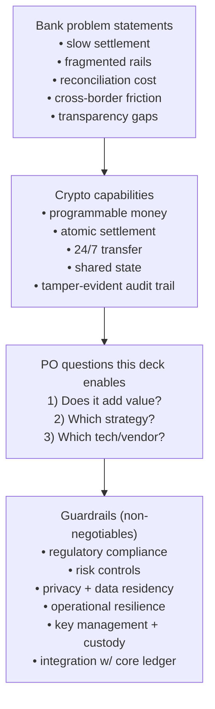

---

## **Slide 2 — Crypto primitives (terminology everyone must share)**

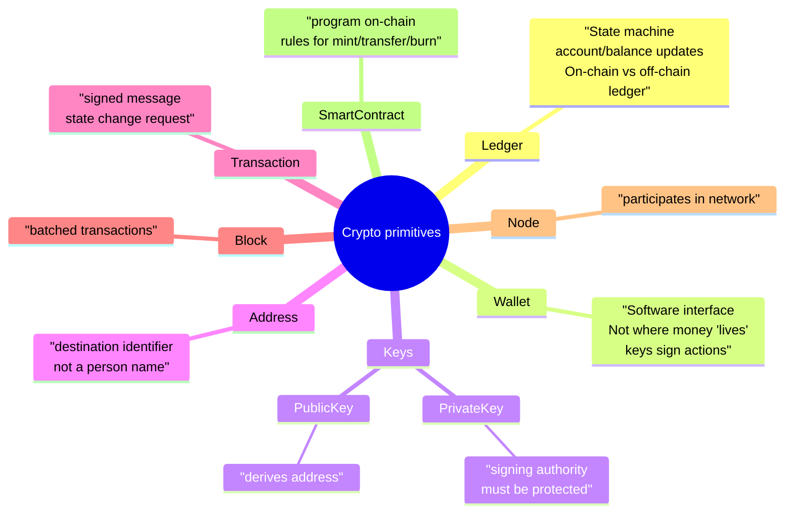

---

## **Slide 3 — Networks & trust models (public vs private + consensus + finality)**

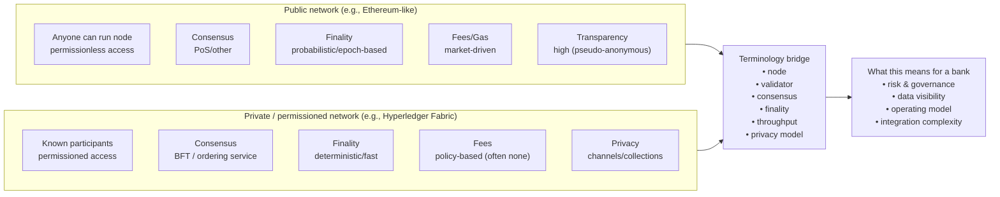

---

## **Slide 4 — What is blockchain? (plain-English)**

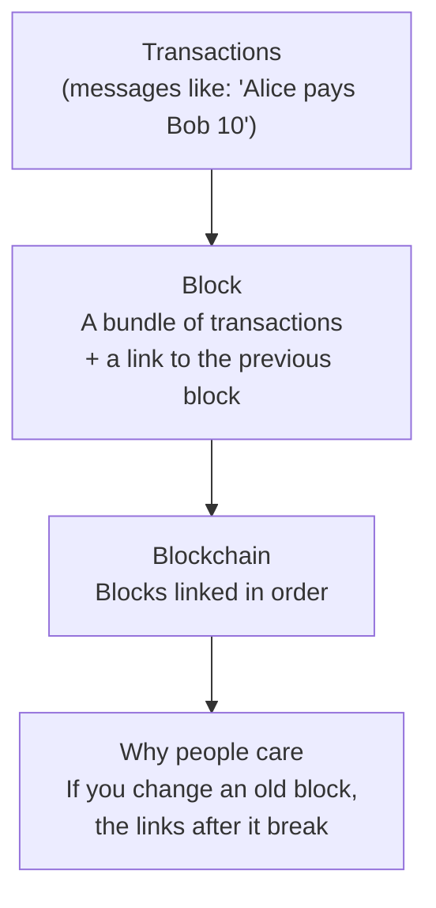

---

## **Slide 5 — Blockchain network basics (how it “runs”)**

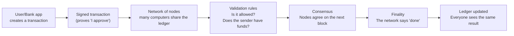

---

## **Slide 6 — Two network models: Public vs Private**

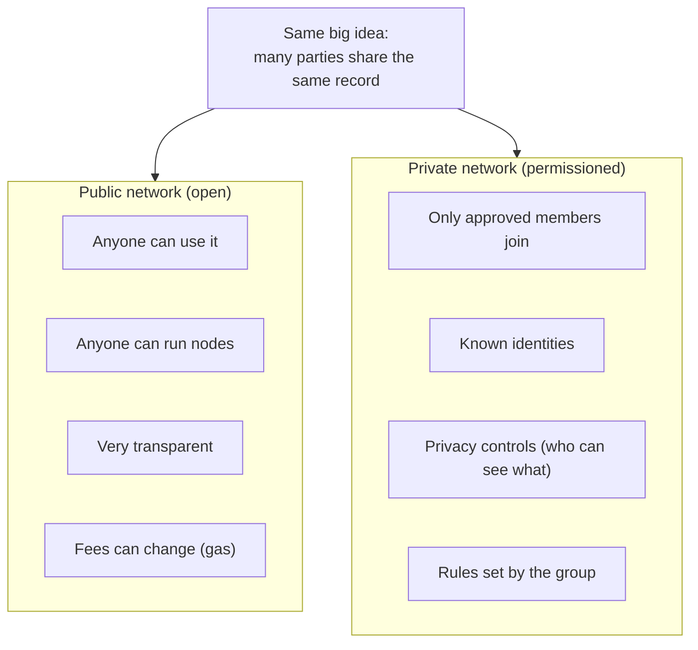

---

## **Slide 7 — Stablecoin (digital dollars on crypto rails)**

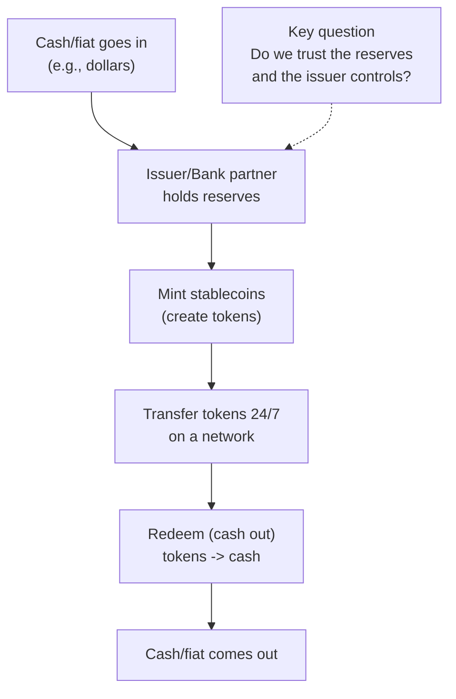

---

## **Slide 8 — Tokenized deposit (bank deposits as tokens)**

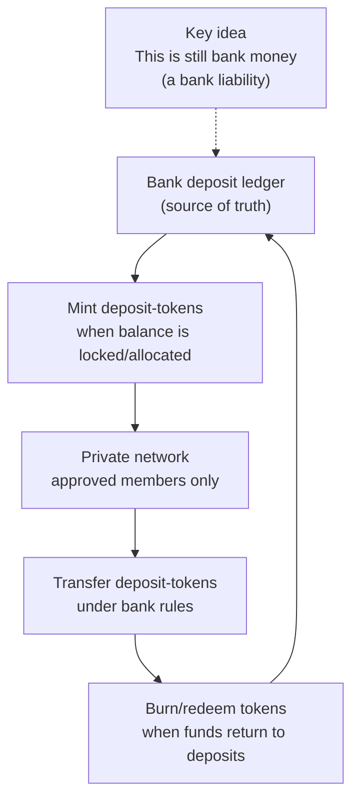

---

## **Slide 9 — NB250A (tokenizing operations, not money)**

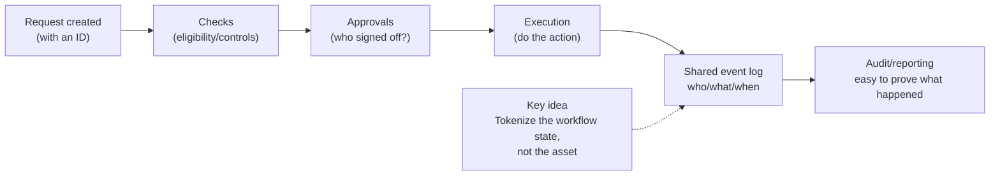

---

## **Slide 10 — Potential use cases in Scotiabank (simple examples)**

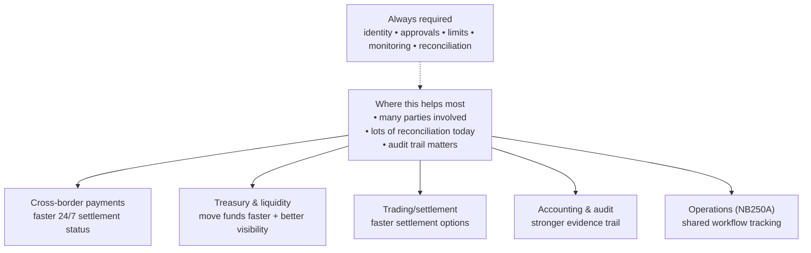
