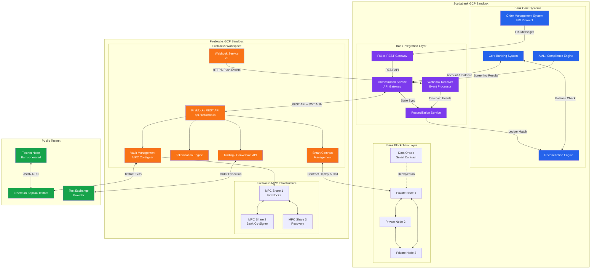
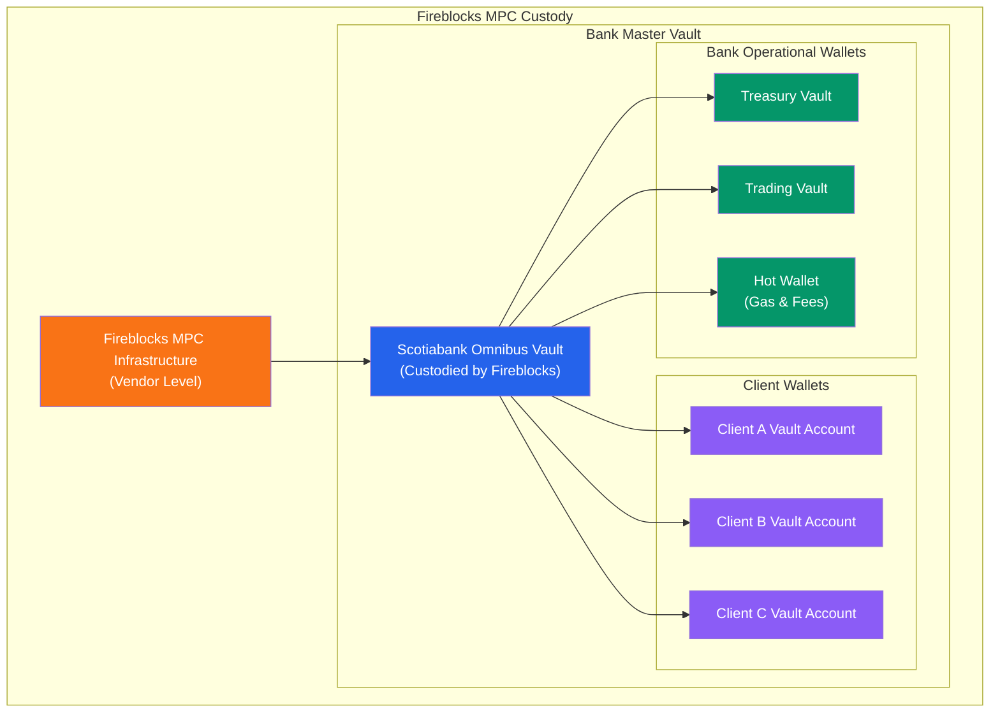
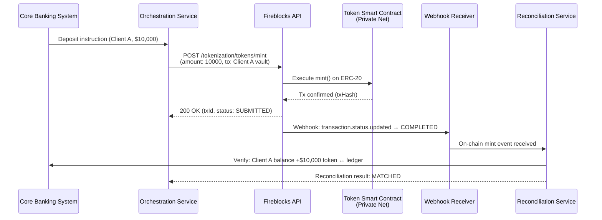
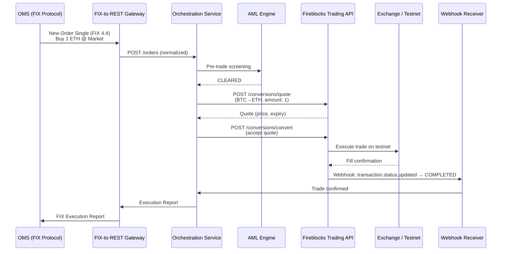

# Scotiabank x Fireblocks PoC — Analysis & Architecture

## 1. Fireblocks API Capability Mapping

Below maps each PoC test item to Fireblocks developer portal APIs and features.

| PoC Test Item | Fireblocks API / Feature | Endpoint / SDK | Notes |
|---|---|---|---|
| **Crypto Transfer (Private Net)** | Transaction API | `POST /v1/transactions` (`TRANSFER`) | Transfer between vault accounts on the private network; supports internal transfers with MPC-secured signing |
| **Tokenization (Tokenized Deposit)** | Tokenization API | `POST /v1/tokenization/tokens` (deploy), `mint`, `burn` | Deploy ERC-20 compatible token representing bank deposits; manage supply via mint/burn lifecycle |
| **Wallet Management** | Vault Account API | `POST /v1/vault/accounts`, `POST /v1/vault/accounts/{id}/{assetId}` | Hierarchical vault structure: create vault accounts, generate deposit addresses, assign assets |
| **Custody Hierarchy (Client → Bank → Vendor)** | Vault API + Workspace Architecture | Vault accounts + omnibus structure | Client sub-wallets held under bank's master vault; bank's master vault custodied in Fireblocks MPC infrastructure |
| **Crypto Trading on Testnet** | Trading / Conversion API | `POST /v1/conversions/convert`, `POST /v1/conversions/quote` | Execute swaps and trades via connected exchange providers on testnet |
| **FIX Protocol from OMS** | *Not natively supported* — requires bank-side FIX-to-REST adapter | Bank builds FIX Gateway → calls Fireblocks REST API | Fireblocks exposes REST + SDK; bank integration layer translates FIX messages to API calls |
| **API Call Acceptance** | REST API + SDK (TypeScript, Python, Java) | Full API suite via `api.fireblocks.io` | Co-signed JWT authentication with API key + RSA private key |
| **On-Chain Data Streaming** | Webhooks v2 | `POST /v1/webhooks` + event subscriptions | Events: `transaction.created`, `transaction.status.updated`, `network_records.processing_completed`; HTTPS push with retry/backoff |
| **Reconciliation with Core Banking** | Transaction History API + Webhooks | `GET /v1/transactions` (list/filter) + webhook events | Pull transaction history for batch reconciliation; push via webhooks for real-time matching |
| **Data Oracle Deployment** | Smart Contract API + Raw Signing | `POST /v1/transactions` (`CONTRACT_CALL`), Web3 Provider | Deploy oracle contract via transaction API; interact using EVM Web3 Provider or local JSON-RPC |
| **Private Net (3 Nodes)** | Private blockchain support | Infrastructure-level setup | Fireblocks supports private/permissioned chains; coordinate with Fireblocks for MPC co-signer integration on private nodes |
| **Testnet Node (Dummy Trade)** | Testnet Workspace | Fireblocks Sandbox workspace on testnet (e.g., Ethereum Sepolia) | Free sandbox workspace for testing; no real asset risk |

### Key Fireblocks API Categories Used

- **Vault API** — Vault account CRUD, wallet creation, address generation, asset assignment
- **Transaction API** — Transfer, contract call, raw signing, mint/burn operations
- **Tokenization API** — Token deployment (ERC-20/ERC-721), mint, burn, supply management
- **Trading/Conversion API** — Quote, convert, swap across DeFi and CeFi providers
- **Webhooks v2** — Event-driven notifications for transaction lifecycle and vault changes
- **Smart Contract API** — Deploy and interact with contracts via REST, Web3 Provider, or JSON-RPC
- **Raw Signing API** — Sign arbitrary messages for oracle data feeds or unsupported chain operations
- **Blockchain Data API** — Query on-chain state, network status, asset metadata

---

## 2. Architecture & Infrastructure View

### 2.1 High-Level Architecture

### 2.2 Custody Hierarchy

### 2.3 Tokenized Deposit Flow

### 2.4 Trading Flow (OMS → Testnet)

---

## 3. Test Items, Expected Results & Business Value

### Goal 1: Enable Internal Tokenized Deposit

| # | Test Item | Expected Result | Business Value |
|---|---|---|---|
| 1.1 | **Deploy tokenized deposit contract on private network** | ERC-20 token contract successfully deployed via Fireblocks Tokenization API on the 3-node private network; contract address returned and verifiable | Proves the bank can create a digital representation of fiat deposits on a controlled private blockchain |
| 1.2 | **Mint tokenized deposit for client** | Mint transaction completes; client vault account balance reflects new token amount; on-chain state matches | Validates the end-to-end deposit tokenization flow from core banking instruction to on-chain token issuance |
| 1.3 | **Burn (redeem) tokenized deposit** | Burn transaction completes; token supply reduced; core banking system receives redemption event | Confirms the full lifecycle — clients can redeem tokenized deposits back to fiat seamlessly |
| 1.4 | **Transfer tokenized deposit between client wallets** | Internal transfer between two vault accounts completes on private network; both balances updated correctly | Enables instant, 24/7 settlement of tokenized deposit transfers between bank clients without touching traditional rails |
| 1.5 | **Reconcile tokenized deposit with core banking ledger** | Reconciliation service matches on-chain token balances with core banking records; zero discrepancy | Proves data integrity and auditability — regulators can trust the on-chain ledger mirrors the bank's books |
| 1.6 | **Deploy Data Oracle to private network** | Oracle smart contract deployed via Fireblocks Smart Contract API; oracle successfully publishes reference data (e.g., FX rates) on-chain | Demonstrates the bank can push trusted off-chain data onto the blockchain for use in smart contract logic |

### Goal 2: Allow Customer to Hold Stablecoin / CBDC as Digital Asset

| # | Test Item | Expected Result | Business Value |
|---|---|---|---|
| 2.1 | **Create client vault account with asset wallet** | Vault account created via Fireblocks API; deposit address generated for stablecoin asset (e.g., USDC on testnet) | Proves the bank can offer digital asset custody to clients under its existing custody license |
| 2.2 | **Custody hierarchy validation (Client → Bank → Vendor)** | Client wallets are segregated vault accounts under the bank's master vault; Fireblocks MPC secures all signing | Validates the tri-party custody model compliant with banking regulations — client assets clearly segregated |
| 2.3 | **Receive stablecoin into client wallet** | Inbound stablecoin transaction detected via webhook; client vault balance updated; AML screening triggered | Demonstrates real-time visibility into client digital asset holdings with automated compliance checks |
| 2.4 | **Send stablecoin from client wallet** | Outbound transaction signed via MPC, broadcast to testnet, confirmed; webhook event received | Proves secure withdrawal flow with MPC-based approval — no single point of compromise |
| 2.5 | **On-chain data streaming to bank systems** | Webhooks deliver transaction lifecycle events (created → signed → broadcast → confirmed) to bank's event processor in real time | Enables the bank to maintain real-time awareness of all on-chain activity for risk, compliance, and client reporting |
| 2.6 | **AML screening on digital asset transactions** | All inbound/outbound transactions pass through AML engine before or after execution; flagged transactions held | Meets regulatory requirements — digital assets receive the same compliance treatment as traditional assets |

### Goal 3: Allow Trader to Trade Crypto

| # | Test Item | Expected Result | Business Value |
|---|---|---|---|
| 3.1 | **OMS sends trade order via FIX to integration layer** | FIX New Order Single message received by FIX Gateway; parsed and forwarded to orchestration service as REST call | Validates that existing trading infrastructure (OMS) can be reused for crypto — no need to replace trader workflows |
| 3.2 | **Execute crypto trade on testnet** | Trade executes via Fireblocks Trading API on a connected test exchange or DEX; fill confirmed with price and quantity | Proves the bank can execute crypto trades programmatically through Fireblocks' liquidity network |
| 3.3 | **Retrieve trading quote before execution** | Quote returned with price, fees, and expiry time; quote ID used to execute at the quoted price | Enables best-execution compliance — bank can demonstrate pre-trade price discovery to regulators |
| 3.4 | **Trade settlement into vault** | Post-trade assets settled into the bank's trading vault account; balance updated and confirmed via webhook | Confirms atomic settlement — traded assets are immediately secured in MPC-protected custody |
| 3.5 | **Execution report back to OMS** | FIX Execution Report returned to OMS with fill details (price, qty, timestamp, venue) | Closes the loop — traders see fills in their existing OMS screens, maintaining familiar workflows |
| 3.6 | **Testnet node setup and connectivity** | Bank-operated node connects to Ethereum Sepolia testnet; syncs blocks; executes dummy trade transaction | Validates the bank's ability to operate blockchain infrastructure independently for monitoring and redundancy |

### Cross-Cutting Test Items

| # | Test Item | Expected Result | Business Value |
|---|---|---|---|
| C.1 | **Private network (3-node) setup and consensus** | Three nodes on bank GCP sandbox form a private network; blocks produced; transactions finalize with consensus | Proves the bank can operate a private blockchain for internal settlement independent of public networks |
| C.2 | **API authentication and security** | All Fireblocks API calls use co-signed JWT (API key + RSA); failed auth returns 401; IP allowlisting enforced | Meets enterprise security standards — no unauthorized access to digital asset operations |
| C.3 | **Webhook reliability and retry** | Simulated webhook failures trigger automatic retry with exponential backoff; all events eventually delivered | Ensures no data loss in bank-to-vendor communication — critical for reconciliation accuracy |
| C.4 | **End-to-end reconciliation across all flows** | All test transactions (deposit tokens, stablecoin, trades) reconciled with core banking — zero breaks | Proves the entire platform maintains ledger integrity, the non-negotiable requirement for bank regulators |

---

## Summary

This PoC leverages **10+ Fireblocks API categories** spanning vault management, tokenization, trading, smart contracts, and real-time event streaming. The architecture follows a hub-and-spoke model where the **bank's integration layer on GCP** acts as the central orchestrator between existing bank systems (Core, OMS, AML) and Fireblocks' MPC-secured infrastructure.

**Key architectural decisions:**
- **FIX-to-REST Gateway** bridges existing OMS workflow to Fireblocks REST API (Fireblocks does not natively support FIX)
- **Webhook Receiver** enables event-driven architecture for real-time on-chain data propagation to bank systems
- **Private network (3 nodes)** on bank GCP for tokenized deposits; public testnet for trading validation
- **Custody hierarchy** leverages Fireblocks vault structure to enforce Client → Bank → Vendor segregation
- **Data Oracle** deployed via Fireblocks Smart Contract API demonstrates the bank's ability to bridge off-chain data on-chain
