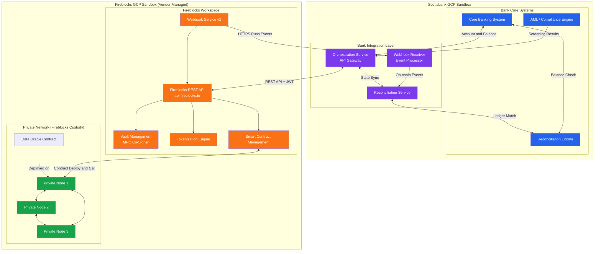

# Scotiabank x Fireblocks PoC - Analysis Overview

## 1) Scope Update (2026-03-04)

This PoC is now focused on:

- Tokenized deposit on a private network fully managed in the Fireblocks GCP sandbox
- Wallet management and custody hierarchy validation
- Customer digital asset custody (stablecoin/CBDC holding model)
- Reconciliation between on-chain records and core banking mirror ledgers

Out of scope for this PoC phase:

- Trading API use cases
- FIX-to-REST integration
- OMS trading flows

---

## 2) Architecture Baseline

### 2.1 High-Level Architecture (Updated)

---

## 3) Custody Hierarchy Expansion

Custody hierarchy now supports multiple operating models, not only one omnibus pattern:

- Model A: Omnibus wallet + bank operational wallets + client wallets
- Model B: Per-client wallet segregation (one wallet per client)
- Model C: Business-unit wallet segregation (one wallet per BU)

Detailed diagrams and operating rules are in:

- `AI-generated-presentation/PoC Plan/usecase-1-tokenized-deposit.md`
- `AI-generated-presentation/PoC Plan/usecase-2-digital-asset-custody.md`

---

## 4) Test Goal Scope (Revised)

Only Goal 1 and Goal 2 remain in this phase:

- Goal 1: Tokenized deposit on private network, including wallet management
- Goal 2: Customer digital asset custody model (stablecoin/CBDC holding)

Goal 3 (trading) is removed from this document set.

---

## 5) Artifact Split by Business Use Case

This overview document is intentionally concise. Detailed content is split into separate artifacts:

- `AI-generated-presentation/PoC Plan/usecase-1-tokenized-deposit.md`
- `AI-generated-presentation/PoC Plan/usecase-2-digital-asset-custody.md`
- `AI-generated-presentation/PoC Plan/poc-artifacts-catalog.md`
