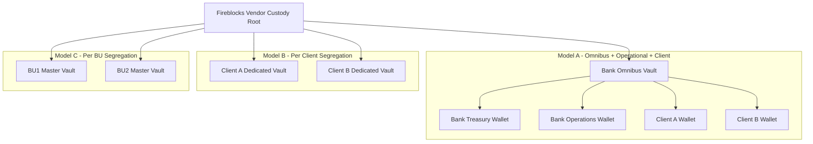
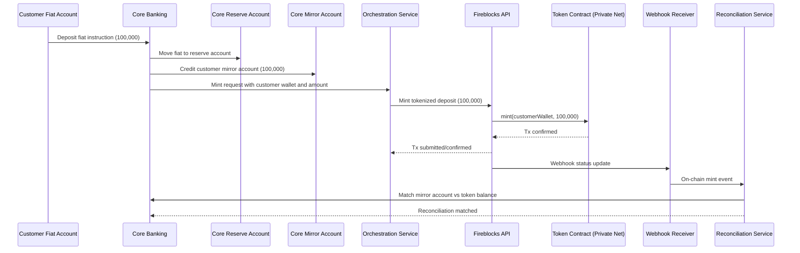
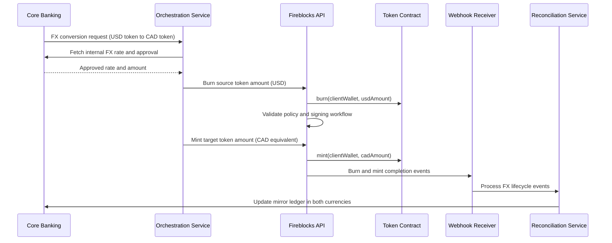
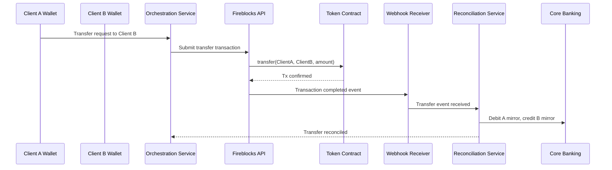
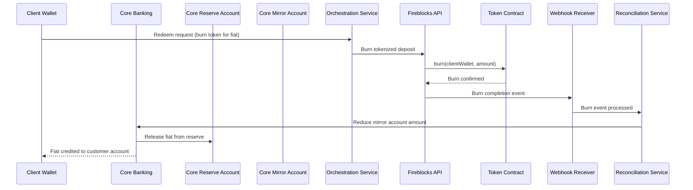

# Use Case 1 - Tokenized Deposit on Private Network

## 1) Objective

Validate end-to-end tokenized deposit lifecycle on a private network managed in Fireblocks GCP sandbox, including wallet management, fiat mirror accounting, and reconciliation.

---

## 2) Target Capability

- Deploy tokenized deposit contract on private network
- Manage vault and wallet hierarchy for bank operations and customers
- Mint, transfer, perform FX movement, and burn tokenized deposits
- Keep fiat and token ledgers synchronized in core banking

---

## 3) Custody Hierarchy Models

---

## 4) Sequence - Minting with Fiat Mirror

---

## 5) Additional Sequences Requested

### 5.1 FX Scenario (Tokenized Deposit FX Reallocation)

### 5.2 Transaction Scenario (Wallet-to-Wallet Transfer)

### 5.3 Burning Scenario (Redeem Back to Fiat)

---

## 6) Goal 1 Test Items (Updated)

| # | Test Item | Expected Result | Business Value |
|---|---|---|---|
| 1.1 | Deploy tokenized deposit contract on private network | Contract deployed and verifiable on private network nodes managed by Fireblocks | Establishes programmable deposit rail |
| 1.2 | Wallet management for tokenized deposit accounts | Required vault accounts and wallets created for client/bank/BU model | Enables scalable account onboarding |
| 1.3 | Mint tokenized deposit from fiat instruction | Mint confirmed; mirror ledger and reserve movement aligned | Proves fiat-token synchronization |
| 1.4 | Transfer tokenized deposit between wallets | On-chain transfer confirmed; sender/receiver mirror accounts updated | Enables internal real-time settlement |
| 1.5 | FX token movement lifecycle | Burn/mint FX flow executed and reconciled with multi-currency ledger | Supports treasury and cross-currency operations |
| 1.6 | Burn/redeem tokenized deposit to fiat | Burn completed; fiat returned through reserve release | Confirms full lifecycle redemption |
| 1.7 | End-to-end reconciliation | On-chain balances and core mirror accounts match with zero breaks | Satisfies control and audit requirements |

