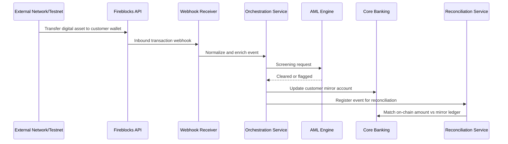
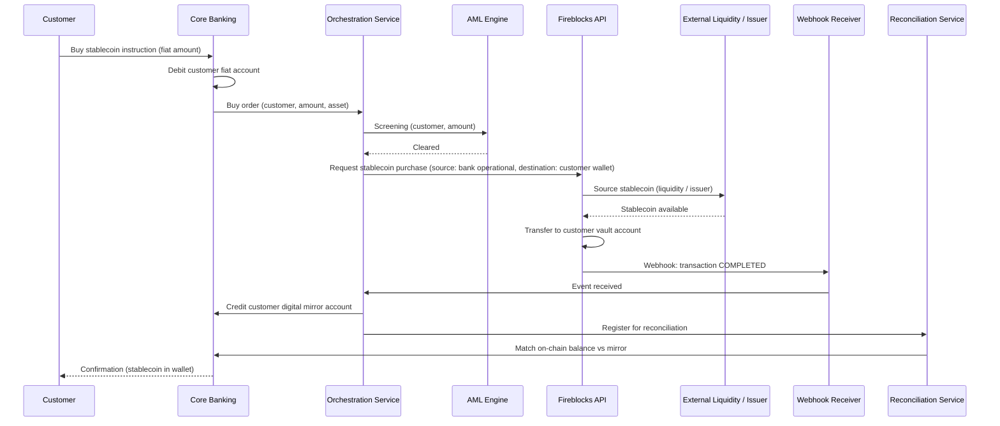
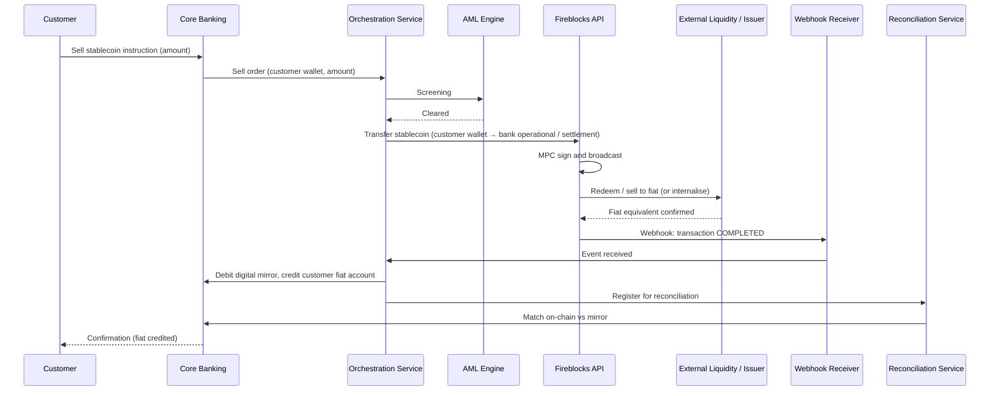
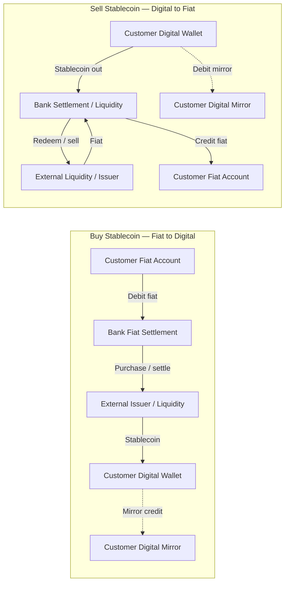

# Use Case 2 - Customer Digital Asset Custody

## 1) Objective

Validate customer custody operating model for stablecoin/CBDC-style assets with clear segregation, governance, and operational controls.

---

## 2) Capability Scope

- Customer wallet onboarding under bank custody model
- Segregated wallet hierarchy by client and by business unit where required
- Inbound asset reception and event streaming
- Outbound transfer with policy checks and approvals
- Reconciliation to core banking mirror records

---

## 3) Custody Operating Models

### Model A - Omnibus anchored
- Bank omnibus vault is the primary anchor.
- Customer wallets and bank operations wallets are children.
- Useful for simpler operations and centralized treasury controls.

### Model B - Dedicated wallet per client
- Each customer has dedicated vault ownership boundary.
- Stronger segregation and cleaner client-level reporting.
- Preferred where legal segregation is required.

### Model C - Dedicated wallet per BU
- Each business unit has dedicated custody domain.
- Supports BU-level PnL, policy, and governance boundaries.
- Can coexist with Model B for large segments.

---

## 4) Sequence - Custody Receive and Mirror

---

## 5) Buy / Sell Stablecoin (Fiat ↔ External Issuer Stablecoin)

When the bank allows customers to **buy** (fiat → stablecoin) or **sell** (stablecoin → fiat) stablecoin issued **outside** the bank (e.g. USDC, third-party issuer), the following flows apply.

### 5.1 Sequence — Buy Stablecoin (Fiat → Stablecoin)

### 5.2 Sequence — Sell Stablecoin (Stablecoin → Fiat)

### 5.3 Money Movement — Flow Diagram (Buy & Sell)

Fiat and digital (stablecoin) movement for **buy** and **sell**:

**Legend:**

| Flow | Fiat movement | Digital (stablecoin) movement |
|------|----------------|-------------------------------|
| **Buy** | Customer fiat account debited → bank fiat settlement; bank sources stablecoin from external issuer/liquidity | Stablecoin received into customer vault (wallet); customer digital mirror credited |
| **Sell** | Bank receives fiat from external liquidity/issuer; customer fiat account credited | Customer wallet debited (stablecoin transferred out); customer digital mirror debited |

---

## 6) Goal 2 Test Items (Updated)

| # | Test Item | Expected Result | Business Value |
|---|---|---|---|
| 2.1 | Create customer vault account and wallet | Wallet created with expected governance policy | Establishes onboarding flow for custody |
| 2.2 | Validate custody hierarchy model | Chosen model (omnibus/per-client/per-BU) configured and auditable | Confirms controllable and compliant setup |
| 2.3 | Receive digital asset into customer wallet | Inbound event detected and posted to mirror account | Provides real-time holdings visibility |
| 2.4 | Outbound digital asset transfer with controls | Transfer processed only with policy approvals and AML checks | Demonstrates secure withdrawals |
| 2.5 | On-chain event streaming to bank systems | Webhooks delivered and consumed reliably | Enables operational monitoring and controls |
| 2.6 | Reconciliation with core banking mirror | Reconciliation run produces zero unreconciled breaks | Validates accounting integrity |

---

## 7) Non-Scope Clarification

The following items are out of scope in this use case and this PoC phase:

- Trading APIs and execution flows
- FIX protocol integration
- OMS order lifecycle

