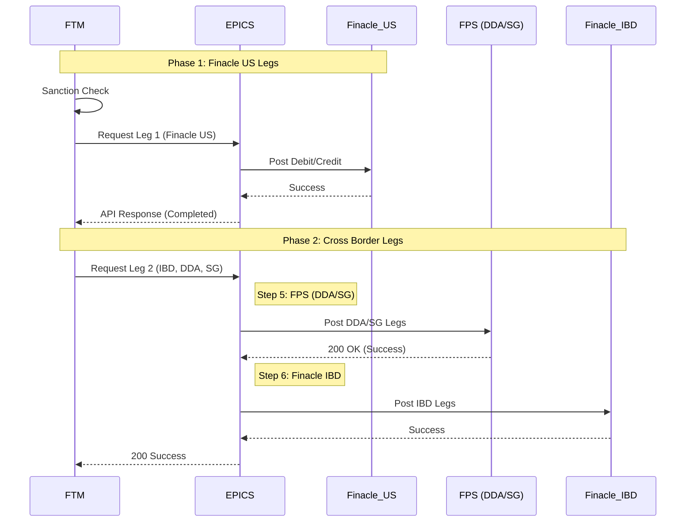
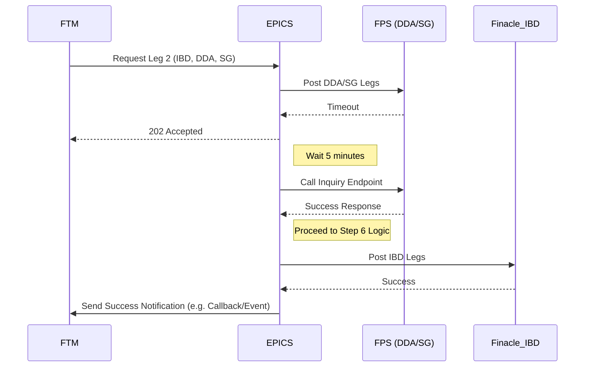
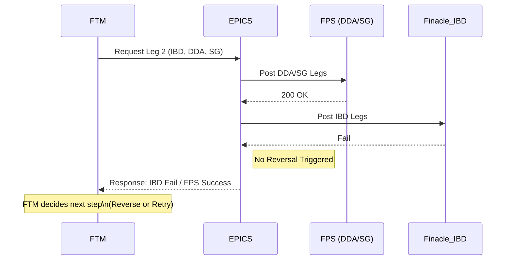
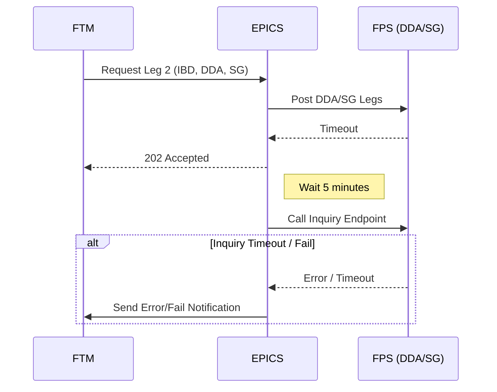
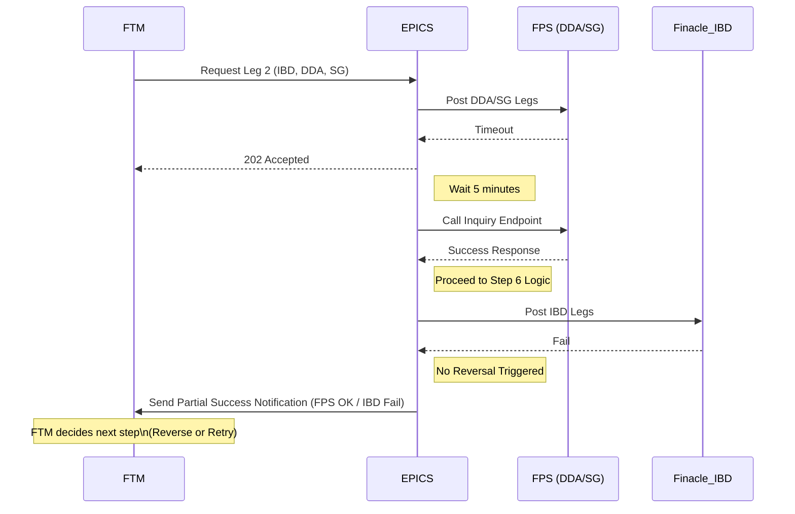
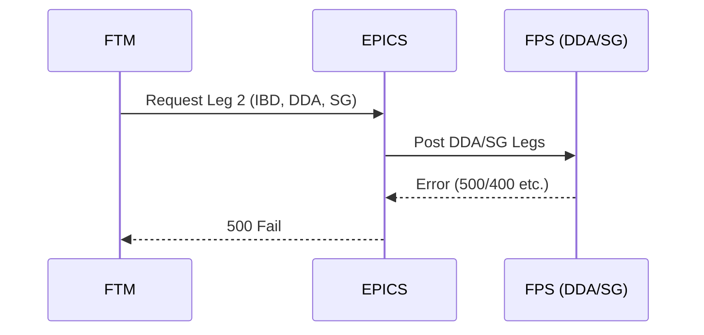
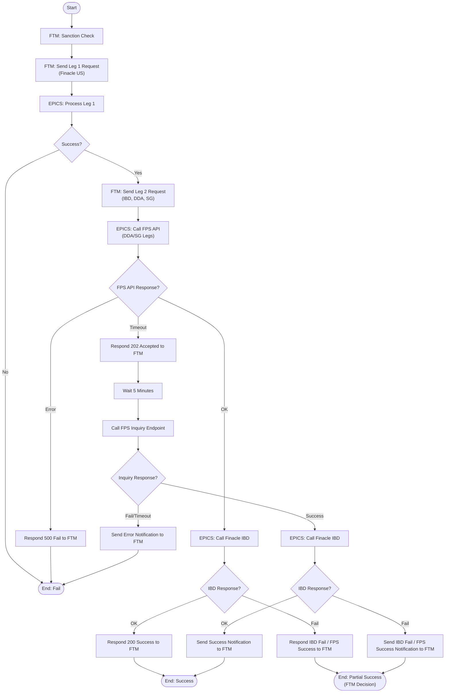

# Posting Model Diagrams (Interim) - US -> Canada

## 1. Scenario: Happy Path (Synchronous Success)
*Everything succeeds immediately via API.*

## 2. Scenario: Async Path (FPS Timeout -> Inquiry Success)
*FPS API times out, EPICS waits 5 minutes, calls Inquiry endpoint, then proceeds successfully.*

## 3. Scenario: Synchronous Error (Finacle IBD Fail - Partial Success)
*FPS succeeds, but Finacle IBD fails. EPICS reports partial success (IBD Fail) to FTM without reversing.*

## 4. Scenario: Async Failure (Inquiry Timeout or Fail)
*FPS API times out, EPICS waits 5 minutes, calls Inquiry, and Inquiry fails or times out.*

## 5. Scenario: Async Partial Success (FPS Timeout -> Inquiry Success -> IBD Fail)
*FPS API times out, Inquiry confirms success, but Finacle IBD fails. EPICS reports partial success.*

## 6. Scenario: FPS Error (Immediate Fail)
*FPS API returns an explicit Error (not Timeout). EPICS fails immediately.*

## 7. Logic Flowchart (Interim)

## 8. Accounting T-Charts (Sequence of Events)

### Phase 1: Finacle US (Step 2)

| Finacle US | |
| :--- | :--- |
| **Debit** | **Credit** |
| Customer Account | |
| | ICA Account (GUS.IBD) |

### Phase 2: Cross Border - First Half (FPS - DDA & SG) (Step 4 & 5)

| DDA System | |
| :--- | :--- |
| **Debit** | **Credit** |
| DDA Pool Account | |
| | Customer Account (Canada) |
| | DDA Pool Account |

| SG System | |
| :--- | :--- |
| **Debit** | **Credit** |
| SG FNCL Offset | |
| ICA(HOU) | |
| | Fin Offset |

### Phase 2: Cross Border - Second Half (Finacle IBD) (Step 4 & 6)

| Finacle IBD | |
| :--- | :--- |
| **Debit** | **Credit** |
| ICA(HOU) | |
| | Suspense Account |
