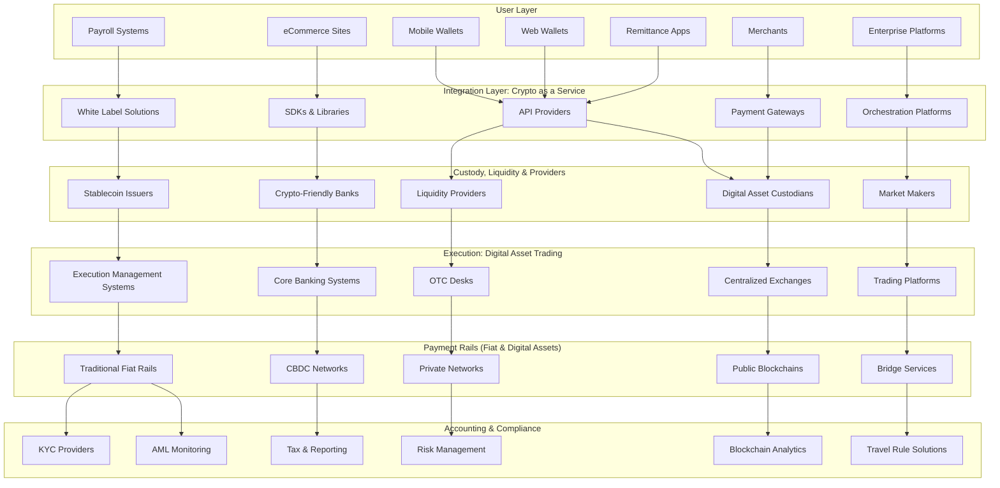

I'll help you research stablecoin infrastructure according to your framework. This is a complex topic that requires thorough investigation of current vendors and solutions. Let me conduct comprehensive research to provide you with accurate, up-to-date information.Now let me search for more specific vendors for custody, liquidity, and digital asset trading platforms:Now let me search for liquidity providers and digital asset trading platforms:Now let me search for digital asset trading platforms and exchanges:Now let me search for payment rails and blockchain infrastructure:Finally, let me search for compliance and regulatory tools:Now I have comprehensive research on all layers of the stablecoin infrastructure stack. Let me compile this information into the two deliverables you requested.

## 1. Mermaid Diagram: Stablecoin Infrastructure Layers

## 2. Vendor Analysis Tables by Layer

### Integration Layer: Crypto as a Service Platforms

| Vendor | Website | Description | Key Features |
|--------|---------|-------------|--------------|
| **Bridge (Stripe)** | bridge.xyz | Stablecoin infrastructure APIs | Orchestration APIs, issuance capabilities, multi-currency support |
| **BVNK** | bvnk.com | Enterprise stablecoin infrastructure | Layer1 infrastructure, licensing support, custody integration |
| **Transak** | transak.com | Fiat-to-crypto infrastructure | 75+ countries, local payment methods, virtual IBANs |
| **OpenPayd** | openpayd.com | Financial infrastructure platform | Stablecoin capabilities, fiat rails integration, global licenses |
| **Fireblocks** | fireblocks.com | Digital asset infrastructure | Network for Payments, 100+ countries, unified APIs |
| **4IRE Labs** | 4irelabs.com | Stablecoin development | White-label platforms, DeFi integration, consulting |
| **Rail (Ripple)** | ripple.com | Stablecoin payment platform | Virtual accounts, 12+ banking partners, B2B focus |
| **ChangeNOW** | changenow.io | Liquidity aggregator | 1500+ assets, fiat ramps, flexible commissions |
| **MoonPay** | moonpay.com | On/off-ramp provider | Global coverage, multiple payment methods |
| **Wyre** | sendwyre.com | Payment infrastructure | API-first approach, compliance built-in |

**Selection Criteria:**
1. **API Quality & Documentation** - Ease of integration, comprehensive docs
2. **Geographic Coverage** - Number of countries/regions supported
3. **Regulatory Compliance** - Licenses held, KYC/AML capabilities
4. **Settlement Speed** - Transaction processing times
5. **Fee Structure** - Transparent pricing, competitive rates
6. **Scalability** - Ability to handle volume growth
7. **Security Standards** - SOC2, ISO certifications
8. **Support Quality** - 24/7 availability, technical expertise

### Custody, Liquidity & Providers

#### Digital Asset Custodians

| Vendor | Website | Description | Key Features |
|--------|---------|-------------|--------------|
| **Anchorage Digital** | anchorage.com | OCC-chartered crypto bank | MPC technology, $75M insurance, staking support |
| **Coinbase Custody** | coinbase.com/custody | NY Trust Company | 80% of BTC/ETH ETF custody, SOC 1/2 audits |
| **BNY Mellon** | bnymellon.com | Traditional bank custody | USDC/RLUSD custody, bank-grade security |
| **BitGo** | bitgo.com | Multi-sig pioneer | $250M insurance, 700+ tokens, Web3 custody |
| **Fireblocks (Trust)** | fireblocks.com | NY Trust Company | Cold storage, 2400+ institutions connected |
| **Fidelity Digital Assets** | fidelitydigitalassets.com | Institutional custody | Integrated execution, cold storage |
| **State Street** | statestreet.com | Traditional custody | Digital asset services, bridge with fiat |
| **Hex Trust** | hextrust.com | APAC custody | On-chain segregation, MAS licensed |
| **Sygnum Bank** | sygnum.com | Swiss digital bank | 24/7 settlement, FINMA regulated |
| **Zodia Custody** | zodia.io | Standard Chartered venture | Institutional grade, multiple jurisdictions |

**Selection Criteria:**
1. **Security Architecture** - MPC, HSM, cold storage capabilities
2. **Insurance Coverage** - Amount and scope of coverage
3. **Regulatory Status** - Banking charter, trust license
4. **Asset Support** - Number of cryptocurrencies supported
5. **Geographic Presence** - Jurisdictional coverage
6. **Integration Capabilities** - API quality, platform compatibility
7. **Audit & Compliance** - SOC reports, third-party audits
8. **Disaster Recovery** - Backup systems, recovery time
9. **Client Support** - Dedicated account management
10. **Fee Structure** - AUC fees, transaction costs

#### Liquidity Providers & Market Makers

| Vendor | Website | Description | Key Features |
|--------|---------|-------------|--------------|
| **DWF Labs** | dwf-labs.com | Web3 investor & MM | 60+ exchanges, high-frequency trading |
| **Wintermute** | wintermute.com | Leading market maker | $2.24B daily volume, CEX/DEX coverage |
| **GSR Markets** | gsr.io | Institutional liquidity | 60+ exchanges, proprietary technology |
| **Cumberland (DRW)** | cumberland.io | OTC & liquidity | Institutional focus, risk management |
| **Galaxy Digital** | galaxydigital.io | Full-service provider | 100+ cryptos, public company |
| **Amber Group** | ambergroup.io | Global platform | $5B daily volume, 200+ tokens |
| **B2C2** | b2c2.com | Institutional liquidity | SBI-owned, major exchanges |
| **Keyrock** | keyrock.eu | European market maker | MiCA licensed, global presence |
| **Kronos Research** | kronosresearch.com | Algorithmic trading | Taiwan-based, systematic strategies |
| **Vortex** | vortex.gg | Tier-1 market maker | 180+ projects, 85% retention |

**Selection Criteria:**
1. **Trading Volume** - Daily/monthly volume capabilities
2. **Exchange Coverage** - Number of venues connected
3. **Spread Management** - Bid-ask spread optimization
4. **Technology Stack** - Algorithm sophistication
5. **Risk Management** - Exposure controls, hedging
6. **24/7 Operations** - Uptime and availability
7. **Regulatory Compliance** - Licenses and approvals
8. **Track Record** - Years in operation, client references

### Execution: Digital Asset Trading Platforms

| Vendor | Website | Description | Key Features |
|--------|---------|-------------|--------------|
| **Talos** | talos.com | Institutional trading platform | 60+ venues, smart order routing |
| **FalconX** | falconx.io | Prime brokerage | Integrated custody, derivatives, forex |
| **Wyden** | wyden.io | Bank-focused platform | Temenos integration, treasury management |
| **Elwood** | elwood.io | Trading & investing solutions | Portfolio analytics, risk management |
| **CoinRoutes** | coinroutes.com | Execution platform | 50+ exchanges, algorithmic execution |
| **Bullish** | bullish.com | Institutional exchange | NYSE-listed, AMM integration |
| **Standard Chartered** | sc.com | Bank trading services | Spot trading, NDFs, regulated |
| **Crypto Finance (Deutsche Börse)** | crypto-finance.com | Regulated platform | MiCAR licensed, institutional grade |
| **LMAX Digital** | lmaxdigital.com | Institutional exchange | FCA regulated, deep liquidity |
| **Kraken (OTC)** | kraken.com | Exchange & OTC desk | Large block trades, 24/7 support |

**Selection Criteria:**
1. **Execution Quality** - Slippage, best execution policies
2. **Venue Connectivity** - Number of integrated exchanges
3. **Order Types** - Algorithmic options, smart routing
4. **Latency** - Speed of execution
5. **Reporting Capabilities** - TCA, real-time analytics
6. **API Performance** - FIX protocol, REST/WebSocket
7. **Regulatory Framework** - Compliance with local laws
8. **Settlement Options** - T+0, custody integration
9. **Risk Controls** - Pre-trade checks, position limits
10. **Support Services** - Trading desk availability

### Payment Rails (Fiat & Digital Assets)

| Vendor/Network | Type | Description | Key Features |
|----------------|------|-------------|--------------|
| **Ethereum** | Public Blockchain | Leading smart contract platform | USDC, USDT, DAI support |
| **Polygon** | Layer 2 Network | Ethereum scaling solution | Low fees, fast transactions |
| **Solana** | Public Blockchain | High-performance chain | Sub-second finality |
| **Avalanche** | Public Blockchain | Enterprise-focused | Subnets for private use |
| **Stellar** | Public Blockchain | Payment-focused network | Built for remittances |
| **XRP Ledger** | Public Blockchain | Ripple's network | RLUSD stablecoin |
| **Hyperledger Fabric** | Private Network | Enterprise blockchain | Permissioned, modular |
| **R3 Corda** | Private Network | Financial services focused | Bank consortium backing |
| **SWIFT** | Traditional Rail | Global banking network | Integration with stablecoins |
| **ACH/SEPA** | Traditional Rail | Regional payment systems | Fiat on/off ramps |

**Selection Criteria:**
1. **Transaction Speed** - Finality time, TPS capacity
2. **Cost Efficiency** - Gas fees, transaction costs
3. **Network Effect** - Adoption, liquidity depth
4. **Interoperability** - Bridge availability, cross-chain
5. **Regulatory Clarity** - Compliance framework
6. **Developer Ecosystem** - Tools, documentation
7. **Security Track Record** - Hack history, audit quality

### Accounting & Compliance

| Vendor | Website | Description | Key Features |
|--------|---------|-------------|--------------|
| **Chainalysis** | chainalysis.com | Blockchain analytics leader | KYT, government contracts, 700+ tokens |
| **TRM Labs** | trmlabs.com | Risk management platform | Transaction monitoring, forensics |
| **Elliptic** | elliptic.co | Crypto compliance | Wallet screening, investigation tools |
| **ComplyAdvantage** | complyadvantage.com | AML data provider | Sanctions screening, monitoring |
| **Sumsub** | sumsub.com | Full compliance platform | 220+ countries, Travel Rule |
| **Jumio** | jumio.com | Biometric KYC | AI-powered verification, global coverage |
| **Notabene** | notabene.id | Travel Rule solution | VASP directory, compliance workflows |
| **KYC-Chain** | kyc-chain.com | Crypto-focused KYC | Wallet screening, 270+ risk indicators |
| **Veriff** | veriff.com | Identity verification | Fast onboarding, fraud prevention |
| **Merkle Science** | merklescience.com | Predictive risk platform | Behavioral analysis, DeFi coverage |

**Selection Criteria:**
1. **Coverage Breadth** - Chains supported, token coverage
2. **Data Quality** - False positive rates, accuracy
3. **Real-time Capabilities** - Speed of screening
4. **Regulatory Alignment** - FATF compliance, Travel Rule
5. **Integration Ease** - API quality, implementation time
6. **Reporting Features** - Audit trails, SAR filing
7. **Investigation Tools** - Forensics capabilities
8. **Customer Support** - Training, ongoing assistance
9. **Pricing Model** - Volume-based, flat fee options
10. **Global Reach** - Language support, regional compliance

---

This comprehensive framework provides a complete overview of the stablecoin infrastructure ecosystem, with detailed vendor options for each layer and clear selection criteria to guide your decision-making process. The Mermaid diagram visualizes how all these components interconnect to enable stablecoin operations within your BNS (Banking Network Services) environment.