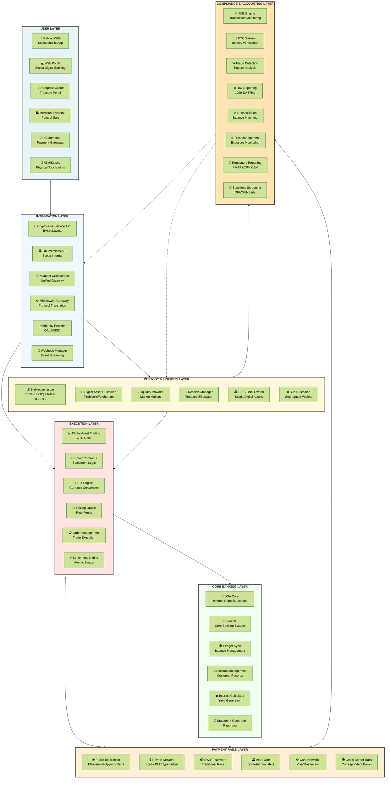
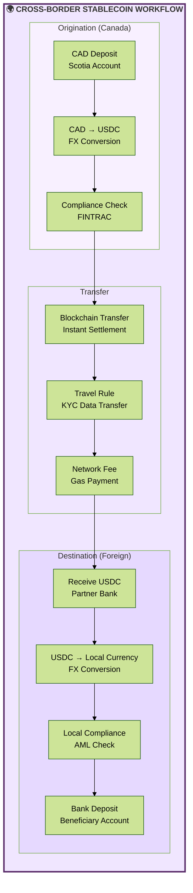

# Scotiabank Stablecoin Infrastructure Framework

## 1. Complete Infrastructure Diagram with All Entities

## 2. Stablecoin Issuance Workflow

```mermaid
---
config:
  theme: 'forest'
---
flowchart LR
    %% Stablecoin Issuance Flow
    subgraph IssuanceFlow["<b>🪙 STABLECOIN ISSUANCE WORKFLOW</b>"]
        direction TB
        style IssuanceFlow fill:#e6ffe6,stroke:#2d6a2d,stroke-width:3px
        
        %% Initiation
        subgraph InitPhase["Initiation Phase"]
            style InitPhase fill:#f0fff0
            ClientRequest["Client Request<br/>CAD Deposit"] 
            KYCCheck["KYC/AML Check<br/>Customer Verification"]
            RiskAssess["Risk Assessment<br/>Compliance Review"]
        end
        
        %% Fiat Processing
        subgraph FiatPhase["Fiat Processing"]
            style FiatPhase fill:#f5fffa
            FiatDeposit["Fiat Deposit<br/>Scotia DDA Account"]
            ReserveAlloc["Reserve Allocation<br/>Treasury Bills/Cash"]
            EscrowHold["Escrow Hold<br/>Segregated Account"]
        end
        
        %% Minting Process
        subgraph MintPhase["Minting Phase"]
            style MintPhase fill:#e6ffe6
            IssuerAPI["Call Issuer API<br/>Circle/Tether"]
            MintRequest["Mint Request<br/>1:1 CAD:Stablecoin"]
            SmartContract["Smart Contract<br/>Token Generation"]
            BlockConfirm["Blockchain Confirmation<br/>On-chain Verification"]
        end
        
        %% Distribution
        subgraph DistPhase["Distribution"]
            style DistPhase fill:#f0fff0
            WalletCredit["Wallet Credit<br/>Customer Wallet"]
            BalanceUpdate["Balance Update<br/>Core Banking"]
            Notification["Notification<br/>Customer Alert"]
        end
        
        ClientRequest --> KYCCheck
        KYCCheck --> RiskAssess
        RiskAssess --> FiatDeposit
        FiatDeposit --> ReserveAlloc
        ReserveAlloc --> EscrowHold
        EscrowHold --> IssuerAPI
        IssuerAPI --> MintRequest
        MintRequest --> SmartContract
        SmartContract --> BlockConfirm
        BlockConfirm --> WalletCredit
        WalletCredit --> BalanceUpdate
        BalanceUpdate --> Notification
    end
```

## 3. Stablecoin Trading Workflow

```mermaid
---
config:
  theme: 'forest'
---
flowchart TB
    %% Stablecoin Trading Flow
    subgraph TradingFlow["<b>💱 STABLECOIN TRADING WORKFLOW</b>"]
        direction TB
        style TradingFlow fill:#e6f3ff,stroke:#2d4a6a,stroke-width:3px
        
        %% Order Placement
        subgraph OrderPhase["Order Placement"]
            style OrderPhase fill:#f0f8ff
            TradeRequest["Trade Request<br/>Buy/Sell Order"]
            OrderValidation["Order Validation<br/>Balance Check"]
            PriceDiscovery["Price Discovery<br/>Market Rates"]
        end
        
        %% Execution
        subgraph ExecutePhase["Execution"]
            style ExecutePhase fill:#e6f3ff
            LiquidityCheck["Liquidity Check<br/>Available Pairs"]
            OrderMatching["Order Matching<br/>Counterparty"]
            SmartExecution["Smart Execution<br/>Best Price"]
            AtomicSwap["Atomic Swap<br/>Simultaneous Exchange"]
        end
        
        %% Settlement
        subgraph SettlePhase["Settlement"]
            style SettlePhase fill:#ddeeff
            OnChainSettle["On-chain Settlement<br/>Blockchain Confirmation"]
            OffChainUpdate["Off-chain Update<br/>Internal Ledger"]
            FeeDeduction["Fee Deduction<br/>Trading Costs"]
        end
        
        %% Post-Trade
        subgraph PostPhase["Post-Trade"]
            style PostPhase fill:#f0f8ff
            Reconciliation2["Reconciliation<br/>Balance Matching"]
            Reporting["Reporting<br/>Trade Confirmation"]
            Archive["Archive<br/>Audit Trail"]
        end
        
        TradeRequest --> OrderValidation
        OrderValidation --> PriceDiscovery
        PriceDiscovery --> LiquidityCheck
        LiquidityCheck --> OrderMatching
        OrderMatching --> SmartExecution
        SmartExecution --> AtomicSwap
        AtomicSwap --> OnChainSettle
        OnChainSettle --> OffChainUpdate
        OffChainUpdate --> FeeDeduction
        FeeDeduction --> Reconciliation2
        Reconciliation2 --> Reporting
        Reporting --> Archive
    end
```

## 4. Stablecoin Redemption Workflow

```mermaid
---
config:
  theme: 'forest'
---
flowchart LR
    %% Stablecoin Redemption Flow
    subgraph RedemptionFlow["<b>💸 STABLECOIN REDEMPTION WORKFLOW</b>"]
        direction TB
        style RedemptionFlow fill:#ffe6e6,stroke:#6a2d2d,stroke-width:3px
        
        %% Initiation
        subgraph RedeemInit["Initiation"]
            style RedeemInit fill:#fff0f0
            RedeemRequest["Redemption Request<br/>Stablecoin to Fiat"]
            WalletVerify["Wallet Verification<br/>Ownership Check"]
            ComplianceCheck["Compliance Check<br/>AML Screening"]
        end
        
        %% Burn Process
        subgraph BurnPhase["Burn Process"]
            style BurnPhase fill:#ffe6e6
            TransferCustody["Transfer to Custody<br/>Scotia Control"]
            BurnRequest["Burn Request<br/>Issuer API"]
            TokenBurn["Token Burn<br/>Smart Contract"]
            BurnConfirm["Burn Confirmation<br/>On-chain Verify"]
        end
        
        %% Fiat Release
        subgraph FiatRelease["Fiat Release"]
            style FiatRelease fill:#ffdddd
            ReserveRelease["Reserve Release<br/>Treasury Unlock"]
            FiatTransfer["Fiat Transfer<br/>Bank Wire/ACH"]
            AccountCredit["Account Credit<br/>Customer DDA"]
        end
        
        %% Confirmation
        subgraph ConfirmPhase["Confirmation"]
            style ConfirmPhase fill:#fff0f0
            TxConfirm["Transaction Confirmation<br/>Customer Notice"]
            RecordUpdate["Record Update<br/>Core Banking"]
            AuditLog["Audit Log<br/>Compliance Record"]
        end
        
        RedeemRequest --> WalletVerify
        WalletVerify --> ComplianceCheck
        ComplianceCheck --> TransferCustody
        TransferCustody --> BurnRequest
        BurnRequest --> TokenBurn
        TokenBurn --> BurnConfirm
        BurnConfirm --> ReserveRelease
        ReserveRelease --> FiatTransfer
        FiatTransfer --> AccountCredit
        AccountCredit --> TxConfirm
        TxConfirm --> RecordUpdate
        RecordUpdate --> AuditLog
    end
```

## 5. Stablecoin Payment Workflow

```mermaid
---
config:
  theme: 'forest'
---
flowchart TB
    %% Stablecoin Payment Flow
    subgraph PaymentFlow["<b>💳 STABLECOIN PAYMENT WORKFLOW</b>"]
        direction TB
        style PaymentFlow fill:#fff9e6,stroke:#6a5a2d,stroke-width:3px
        
        %% Payment Initiation
        subgraph PayInit["Payment Initiation"]
            style PayInit fill:#fffef0
            PayRequest["Payment Request<br/>Merchant/P2P"]
            PayerAuth["Payer Authentication<br/>2FA/Biometric"]
            BalanceCheck["Balance Check<br/>Sufficient Funds"]
        end
        
        %% Payment Processing
        subgraph PayProcess["Processing"]
            style PayProcess fill:#fff9e6
            RecipientValid["Recipient Validation<br/>Wallet/Account"]
            FXConversion["FX Conversion<br/>If Cross-Currency"]
            RouteOptimize["Route Optimization<br/>Best Path"]
            GasFeeCalc["Gas Fee Calculation<br/>Network Costs"]
        end
        
        %% Execution
        subgraph PayExecute["Execution"]
            style PayExecute fill:#fff3cc
            TxBroadcast["Transaction Broadcast<br/>Blockchain Submit"]
            NetworkConfirm["Network Confirmation<br/>Block Mining"]
            InstantSettle["Instant Settlement<br/>Real-time"]
        end
        
        %% Post-Payment
        subgraph PostPay["Post-Payment"]
            style PostPay fill:#fffef0
            MerchantNotify["Merchant Notification<br/>Payment Received"]
            Receipt["Receipt Generation<br/>Transaction Details"]
            LedgerUpdate["Ledger Update<br/>Both Parties"]
            Loyalty["Loyalty/Rewards<br/>Points Credit"]
        end
        
        PayRequest --> PayerAuth
        PayerAuth --> BalanceCheck
        BalanceCheck --> RecipientValid
        RecipientValid --> FXConversion
        FXConversion --> RouteOptimize
        RouteOptimize --> GasFeeCalc
        GasFeeCalc --> TxBroadcast
        TxBroadcast --> NetworkConfirm
        NetworkConfirm --> InstantSettle
        InstantSettle --> MerchantNotify
        MerchantNotify --> Receipt
        Receipt --> LedgerUpdate
        LedgerUpdate --> Loyalty
    end
```

## 6. Cross-Border Payment Workflow

## Key Implementation Considerations for Scotiabank

### 1. **Technology Stack**
- **Blockchain Networks**: Ethereum (mainnet), Polygon (scaling), Private Hyperledger
- **Custody Solution**: Fireblocks or Anchorage for institutional-grade security
- **Smart Contract Platform**: Solidity-based contracts with formal verification
- **API Infrastructure**: RESTful APIs with GraphQL for complex queries

### 2. **Regulatory Compliance**
- **Canadian Regulations**: FINTRAC compliance for AML/CTF
- **GENIUS Act Compliance**: Full BSA requirements for stablecoin operations
- **Provincial Requirements**: Ontario Securities Commission guidelines
- **Cross-border**: FATF Travel Rule implementation

### 3. **Security Architecture**
- **Multi-signature Wallets**: 3-of-5 signature requirement for large transactions
- **Hardware Security Modules (HSM)**: For key management
- **Cold/Hot Wallet Segregation**: 95% cold storage, 5% hot wallet
- **Continuous Monitoring**: 24/7 blockchain analytics and fraud detection

### 4. **Partner Ecosystem**
- **Primary Issuer**: Circle (USDC) for USD stablecoins
- **Canadian Dollar Stablecoin**: Potential partnership for CAD stablecoin
- **Liquidity Providers**: Market makers and OTC desks
- **Technology Partners**: Google Cloud, Microsoft Azure for infrastructure

### 5. **Risk Management**
- **Counterparty Risk**: Due diligence on all stablecoin issuers
- **Operational Risk**: Redundant systems and disaster recovery
- **Market Risk**: Real-time monitoring of stablecoin pegs
- **Regulatory Risk**: Continuous monitoring of evolving regulations

### 6. **Customer Experience**
- **Seamless Integration**: Native integration in Scotia mobile app
- **Transparent Pricing**: Clear fee structure for all operations
- **Real-time Updates**: Push notifications for all transactions
- **Multi-channel Support**: 24/7 customer service for digital assets

### 7. **Scalability Planning**
- **Transaction Throughput**: Support for 10,000+ TPS
- **Geographic Expansion**: Ready for global deployment
- **Product Expansion**: Framework supports multiple stablecoin types
- **Integration Flexibility**: API-first architecture for partner integration