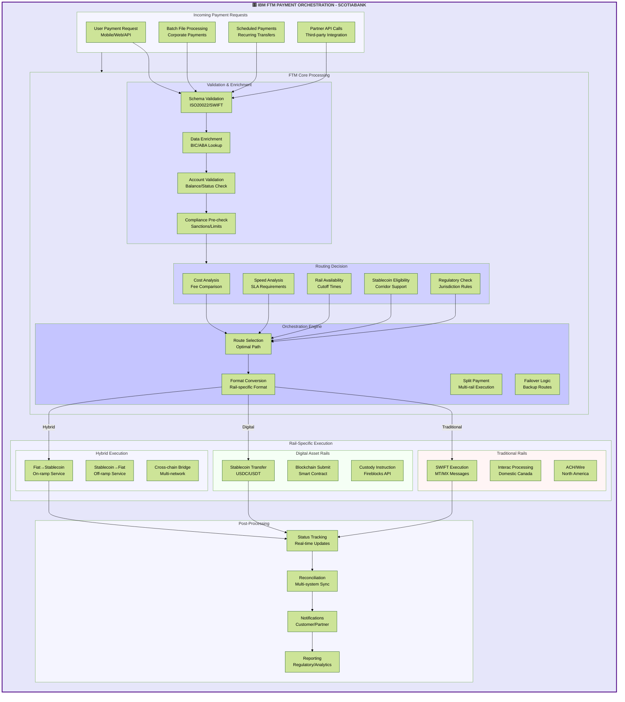
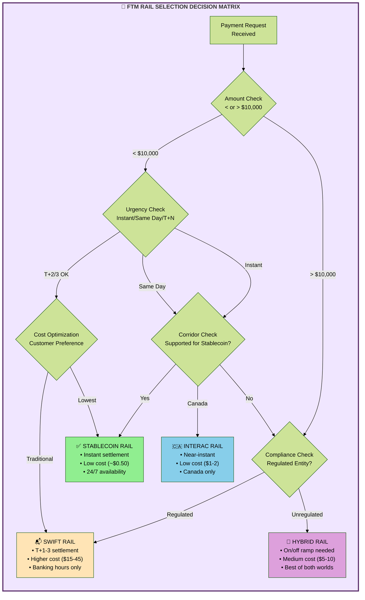
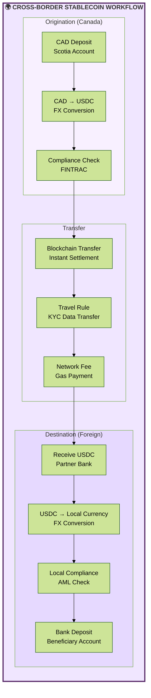

Scotiabank Stablecoin Infrastructure Framework
1. Complete Infrastructure Diagram with All Entities

```mermaid
---
config:
  theme: 'forest'
---

flowchart TB
    %% Class legends
    classDef HAS fill:#c6f6d5,stroke:#2f855a,stroke-width:2px,color:#1a202c
    classDef MOD fill:#fefcbf,stroke:#b7791f,stroke-width:2px,color:#1a202c
    classDef VENDOR fill:#fde8cd,stroke:#c05621,stroke-width:2px,color:#1a202c
    %% Status coloring
    %%class DDA,Finacle,SWIFT,ACH,Interac,CardRails,CrossBorder,FTMCore,ESB,IdentityProvider HAS
    %%class MobileWallet,WebPortal,Enterprise,Merchant,eCommerce,ATM,WebhookMgr,RouteDecision,PaymentHub,FormatTranslator,FeeEngine,LimitChecker,LedgerSync,StatementGen,FraudDetection,Reconciliation,RiskMgmt,RegReporting,KYCSystem ChannelManager MOD
    %%class CryptoAPI,MiddlewareGW,PublicChain,PrivateChain,StablecoinIssuer,Custodian,LiquidityProvider,ReserveManager,EPICOwned,SubCustodian,DATPlatform,SmartContracts,FXEngine,PricingOracle,OrderMgmt,SettlementEngine,AMLEngine,TaxReporting VENDOR

    %% User Layer
    subgraph UserLayer["<b>USER LAYER</b>"]
        direction TB
        style UserLayer fill:#e8f4f8,stroke:#333,stroke-width:2px
        
        MobileWallet["📱 Mobile Wallet<br/>Scotia Mobile App (Crypto features)"]:::MOD
        WebPortal["💻 Web Portal<br/>Scotia Digital Banking (Crypto features)"]:::MOD
        Enterprise["🏢 Enterprise Clients<br/>Treasury Portal (Orion add-on)"]:::MOD
        Merchant["🛍️ Merchant Systems<br/>Point of Sale Integrations"]:::MOD
        eCommerce["🛒 eCommerce<br/>Payment Gateway Integrations"]:::MOD
        ATM["🏧 ATM/Kiosks<br/>Physical Touchpoints"]:::MOD
    end
    
    %% Integration Layer
    subgraph IntegrationLayer["<b>INTEGRATION LAYER</b>"]
        direction TB
        style IntegrationLayer fill:#f0f8ff,stroke:#333,stroke-width:2px
        
        CryptoAPI["🔌 Crypto-as-a-Service API"]:::VENDOR
        OnPremAPI["🏛️ On-Premises API<br/>Scotia Internal"]:::MOD
        MiddlewareGW["⚙️ Middleware Gateway<br/>Trad ↔️ Blockchain Translation"]:::VENDOR
        IdentityProvider["🆔 Identity Provider<br/>OAuth/SSO"]:::HAS
        WebhookMgr["🔔 Webhook/Event Streaming<br/>Blockchain Events"]:::MOD
        ESB["📡 Enterprise Service Bus<br/>System Integration"]:::HAS
    end
    
    %% FTM Payment Orchestration Layer
    subgraph FTMOrchestrationLayer["<b>FTM PAYMENT ORCHESTRATION LAYER</b>"]
        direction LR
        style FTMOrchestrationLayer fill:#e6e6fa,stroke:#4b0082,stroke-width:3px
        
        FTMCore["🎛️ IBM FTM Core<br/>Transaction Manager"]:::HAS
        RouteDecision["🚦 Routing Decision Engine"]:::MOD
        PaymentHub["🔄 Payment Hub<br/>Multi-Rail Gateway"]:::MOD
        FormatTranslator["📝 Format Translator<br/>ISO20022 / SWIFT / Crypto"]:::MOD
        ChannelManager["📊 Channel Manager"]:::MOD
        QueueManager["📬 Queue Manager"]:::HAS
        FeeEngine["💰 Fee Calculation Engine"]:::MOD
        LimitChecker["🚫 Limit Checker"]:::MOD
    end
    
    %% Custody & Liquidity Layer
    subgraph CustodyLiquidityLayer["<b>CUSTODY & LIQUIDITY LAYER</b>"]
        direction TB
        style CustodyLiquidityLayer fill:#fff8dc,stroke:#333,stroke-width:2px
        
        StablecoinIssuer["💰 Stablecoin Issuer"]:::VENDOR
        Custodian["🔐 Digital Asset Custodian<br/>Qualified/MPC"]:::VENDOR
        LiquidityProvider["💧 Liquidity Provider<br/>MM/OTC"]:::VENDOR
        ReserveManager["🏦 Reserve Manager<br/>T-bills/Cash Attestations"]:::VENDOR
        EPICOwned["🏛️ Digital Asset Entity<br/>(Legal/ops wrapper)"]:::VENDOR
        SubCustodian["🔒 Sub-Custodian<br/>Segregated Wallets"]:::VENDOR
    end
    
    %% Execution Layer
    subgraph ExecutionLayer["<b>EXECUTION LAYER</b>"]
        direction TB
        style ExecutionLayer fill:#ffe4e1,stroke:#333,stroke-width:2px
        
        DATPlatform["📊 Digital Asset Trading<br/>OMS/EMS/OTC/RFQ"]:::VENDOR
        SmartContracts["📜 Smart Contracts<br/>Settlement Logic"]:::VENDOR
        FXEngine["💱 FX Engine<br/>Crypto/Fiat Conversion"]:::VENDOR
        PricingOracle["📈 Pricing Oracle<br/>On-chain Feeds"]:::VENDOR
        OrderMgmt["📋 Order Management<br/>Trade Execution"]:::VENDOR
        SettlementEngine["⚡ Settlement Engine<br/>On/Off-chain"]:::VENDOR
    end
    
    %% Core Banking Layer
    subgraph CoreBankingLayer["<b>CORE BANKING LAYER</b>"]
        direction TB
        style CoreBankingLayer fill:#f0fff0,stroke:#333,stroke-width:2px
        
        DDA["🏦 DDA Core<br/>Demand Deposit Accounts"]:::HAS
        Finacle["💼 Finacle<br/>Core Banking System"]:::HAS
        LedgerSync["📚 Ledger Sync<br/>Balances/Events"]:::MOD
        AccountMgmt["👤 Account Management<br/>CIF/CRM"]
        InterestCalc["💵 Interest Calculator"]:::HAS
        StatementGen["📄 Statement Generator<br/>Crypto-aware"]:::MOD
    end
    
    %% Payment Rails Layer
    subgraph PaymentRailsLayer["<b>PAYMENT RAILS LAYER</b>"]
        direction TB
        style PaymentRailsLayer fill:#ffefd5,stroke:#333,stroke-width:2px
        
        PublicChain["🌐 Public Blockchain Access<br/>Node/RPC"]:::VENDOR
        PrivateChain["🔒 Private DLT / Consortia"]:::VENDOR
        SWIFT["📬 SWIFT Network"]:::HAS
        ACH["🏛️ ACH / Wire"]:::HAS
        CardRails["💳 Card Networks"]:::HAS
        CrossBorder["🌍 Cross-Border Rails<br/>Correspondent"]:::HAS
        Interac["🇨🇦 Interac"]:::HAS
    end
    
    %% Compliance Layer
    subgraph ComplianceLayer["<b>COMPLIANCE & ACCOUNTING LAYER</b>"]
        direction TB
        style ComplianceLayer fill:#ffe4b5,stroke:#333,stroke-width:2px
        
        AMLEngine["🚨 Crypto AML / Blockchain Analytics"]:::VENDOR
        KYCSystem["👤 KYC System"]:::MOD
        FraudDetection["🔍 Fraud Detection"]:::MOD
        TaxReporting["📊 Tax Reporting (e.g., 1099-DA)"]:::VENDOR
        Reconciliation["✅ Reconciliation"]:::MOD
        RiskMgmt["⚠️ Risk Management"]:::VENDOR
        RegReporting["📝 Regulatory Reporting<br/>FINTRAC/Travel Rule"]:::MOD
        SanctionScreen["🛑 Sanctions Screening"]:::HAS
    end
    
    %% Connections
    UserLayer --> IntegrationLayer
    IntegrationLayer --> FTMOrchestrationLayer
    
    FTMOrchestrationLayer --> CustodyLiquidityLayer
    FTMOrchestrationLayer --> ExecutionLayer
    FTMOrchestrationLayer --> CoreBankingLayer
    FTMOrchestrationLayer --> PaymentRailsLayer
    
    CustodyLiquidityLayer --> ExecutionLayer
    ExecutionLayer --> CoreBankingLayer
    CoreBankingLayer --> PaymentRailsLayer
    
    PaymentRailsLayer --> ComplianceLayer
    CustodyLiquidityLayer --> ComplianceLayer
    FTMOrchestrationLayer --> ComplianceLayer
    
    ComplianceLayer -.-> FTMOrchestrationLayer
    ComplianceLayer -.-> IntegrationLayer
    ComplianceLayer -.-> CustodyLiquidityLayer
    
    FTMCore --> RouteDecision
    RouteDecision --> PaymentHub
    PaymentHub --> FormatTranslator
    FTMCore --> QueueManager
    FTMCore --> FeeEngine
    FTMCore --> LimitChecker
    ChannelManager --> FTMCore

   
```

FTM Payment Orchestration - Detailed Flow

FTM Decision Matrix for Rail Selection

2. Stablecoin Issuance Workflow
How FTM Orchestrates Between Core Banking, Custody & Payment Rails
FTM as the Central Nervous System
IBM's Financial Transaction Manager (FTM) acts as Scotia's intelligent payment orchestrator, making real-time decisions about how to route payments across traditional and digital rails. Here's how it connects the three critical layers:
1. FTM ↔ Core Banking Integration

Account Inquiry: FTM queries Finacle/DDA for balance availability before initiating any payment
Hold Management: Places temporary holds on accounts during transaction processing
Balance Updates: Sends confirmation back to Core Banking for ledger updates after successful settlement
Fee Deduction: Instructs Core Banking to debit appropriate transaction fees

2. FTM ↔ Custody Layer Integration

Wallet Balance Check: Real-time API calls to Fireblocks/Anchorage for stablecoin balances
Signing Requests: Sends transaction details for cryptographic signing via MPC/HSM
Reserve Verification: Confirms sufficient reserves before minting/burning operations
Custody Instructions: Directs movement of digital assets between wallets

3. FTM ↔ Payment Rails Routing
FTM intelligently selects the optimal rail based on multiple factors:
Decision Factors:

Amount: Small amounts (<$10K) favor stablecoin rails
Speed: Instant requirements route to blockchain
Cost: Optimizes for lowest fee structure
Availability: Checks rail operating hours and cutoff times
Compliance: Ensures regulatory requirements are met
Corridor: Validates if destination supports stablecoin

Example Transaction Flow:
Customer sends $50,000 CAD to Singapore supplier:

1. FTM receives request from Scotia Mobile App
2. Checks Core Banking: Customer has $75,000 CAD available ✓
3. Checks Compliance: Singapore allows stablecoin ✓
4. Analyzes options:
   - SWIFT: $45 fee, 2-3 days
   - Stablecoin: $2 fee, 30 minutes
5. Selects stablecoin rail
6. Instructs Core Banking to debit $50,000 CAD
7. Calls Custody API to convert CAD → USDC
8. Routes to blockchain rail for execution
9. Confirms settlement on-chain
10. Updates all systems with final status
4. FTM Failover & Resilience

Primary Route Failure: Automatically switches to backup rail
Smart Retry Logic: Attempts failed transactions via alternative paths
Circuit Breaker: Prevents cascade failures by stopping problematic routes
Queue Management: Holds transactions during outages for later processing

```mermaid
---
config:
  theme: 'forest'
---
graph LR
    %% Stablecoin Issuance Flow
    subgraph IssuanceFlow["<b>🪙 STABLECOIN ISSUANCE WORKFLOW</b>"]
        direction TB
        style IssuanceFlow fill:#e6ffe6,stroke:#2d6a2d,stroke-width:3px
        
        %% Initiation
        subgraph InitPhase["Initiation Phase"]
            direction LR

            style InitPhase fill:#f0fff0
            ClientRequest["Client Request<br/>CAD Deposit"] 
            KYCCheck["KYC/AML Check<br/>Customer Verification"]
            RiskAssess["Risk Assessment<br/>Compliance Review"]
        end
        
        %% Fiat Processing
        subgraph FiatPhase["Fiat Processing"]
            direction LR
            style FiatPhase fill:#f5fffa
            FiatDeposit["Fiat Deposit<br/>Scotia DDA Account"]
            ReserveAlloc["Reserve Allocation<br/>Treasury Bills/Cash"]
            EscrowHold["Escrow Hold<br/>Segregated Account"]
        end
        
        %% Minting Process
        subgraph MintPhase["Minting Phase"]
            direction LR
            style MintPhase fill:#e6ffe6
            IssuerAPI["Call Issuer API<br/>Circle/Tether"]
            MintRequest["Mint Request<br/>1:1 CAD:Stablecoin"]
            SmartContract["Smart Contract<br/>Token Generation"]
            BlockConfirm["Blockchain Confirmation<br/>On-chain Verification"]
        end
        
        %% Distribution
        subgraph DistPhase["Distribution"]
            style DistPhase fill:#f0fff0
            WalletCredit["Wallet Credit<br/>Customer Wallet"]
            BalanceUpdate["Balance Update<br/>Core Banking"]
            Notification["Notification<br/>Customer Alert"]
        end
        
        ClientRequest --> KYCCheck
        KYCCheck --> RiskAssess
        RiskAssess --> FiatDeposit
        FiatDeposit --> ReserveAlloc
        ReserveAlloc --> EscrowHold
        EscrowHold --> IssuerAPI
        IssuerAPI --> MintRequest
        MintRequest --> SmartContract
        SmartContract --> BlockConfirm
        BlockConfirm --> WalletCredit
        WalletCredit --> BalanceUpdate
        BalanceUpdate --> Notification
    end
```

3. Stablecoin Trading Workflow

```mermaid
---
config:
  theme: 'forest'
---
flowchart TB
    %% Stablecoin Trading Flow
    subgraph TradingFlow["<b>💱 STABLECOIN TRADING WORKFLOW</b>"]
        direction TB
        style TradingFlow fill:#e6f3ff,stroke:#2d4a6a,stroke-width:3px
        
        %% Order Placement
        subgraph OrderPhase["Order Placement"]
            style OrderPhase fill:#f0f8ff
            TradeRequest["Trade Request<br/>Buy/Sell Order"]
            OrderValidation["Order Validation<br/>Balance Check"]
            PriceDiscovery["Price Discovery<br/>Market Rates"]
        end
        
        %% Execution
        subgraph ExecutePhase["Execution"]
            style ExecutePhase fill:#e6f3ff
            LiquidityCheck["Liquidity Check<br/>Available Pairs"]
            OrderMatching["Order Matching<br/>Counterparty"]
            SmartExecution["Smart Execution<br/>Best Price"]
            AtomicSwap["Atomic Swap<br/>Simultaneous Exchange"]
        end
        
        %% Settlement
        subgraph SettlePhase["Settlement"]
            style SettlePhase fill:#ddeeff
            OnChainSettle["On-chain Settlement<br/>Blockchain Confirmation"]
            OffChainUpdate["Off-chain Update<br/>Internal Ledger"]
            FeeDeduction["Fee Deduction<br/>Trading Costs"]
        end
        
        %% Post-Trade
        subgraph PostPhase["Post-Trade"]
            style PostPhase fill:#f0f8ff
            Reconciliation2["Reconciliation<br/>Balance Matching"]
            Reporting["Reporting<br/>Trade Confirmation"]
            Archive["Archive<br/>Audit Trail"]
        end
        
        TradeRequest --> OrderValidation
        OrderValidation --> PriceDiscovery
        PriceDiscovery --> LiquidityCheck
        LiquidityCheck --> OrderMatching
        OrderMatching --> SmartExecution
        SmartExecution --> AtomicSwap
        AtomicSwap --> OnChainSettle
        OnChainSettle --> OffChainUpdate
        OffChainUpdate --> FeeDeduction
        FeeDeduction --> Reconciliation2
        Reconciliation2 --> Reporting
        Reporting --> Archive
    end
```

4. Stablecoin Redemption Workflow

```mermaid
---
config:
  theme: 'forest'
---
graph LR
    %% Stablecoin Redemption Flow
    subgraph RedemptionFlow["<b>💸 STABLECOIN REDEMPTION WORKFLOW</b>"]
        direction TB
        style RedemptionFlow fill:#ffe6e6,stroke:#6a2d2d,stroke-width:3px
        
        %% Initiation
        subgraph RedeemInit["Initiation"]
            style RedeemInit fill:#fff0f0
            RedeemRequest["Redemption Request<br/>Stablecoin to Fiat"]
            WalletVerify["Wallet Verification<br/>Ownership Check"]
            ComplianceCheck["Compliance Check<br/>AML Screening"]
        end
        
        %% Burn Process
        subgraph BurnPhase["Burn Process"]
            style BurnPhase fill:#ffe6e6
            TransferCustody["Transfer to Custody<br/>Scotia Control"]
            BurnRequest["Burn Request<br/>Issuer API"]
            TokenBurn["Token Burn<br/>Smart Contract"]
            BurnConfirm["Burn Confirmation<br/>On-chain Verify"]
        end
        
        %% Fiat Release
        subgraph FiatRelease["Fiat Release"]
            style FiatRelease fill:#ffdddd
            ReserveRelease["Reserve Release<br/>Treasury Unlock"]
            FiatTransfer["Fiat Transfer<br/>Bank Wire/ACH"]
            AccountCredit["Account Credit<br/>Customer DDA"]
        end
        
        %% Confirmation
        subgraph ConfirmPhase["Confirmation"]
            style ConfirmPhase fill:#fff0f0
            TxConfirm["Transaction Confirmation<br/>Customer Notice"]
            RecordUpdate["Record Update<br/>Core Banking"]
            AuditLog["Audit Log<br/>Compliance Record"]
        end
        
        RedeemRequest --> WalletVerify
        WalletVerify --> ComplianceCheck
        ComplianceCheck --> TransferCustody
        TransferCustody --> BurnRequest
        BurnRequest --> TokenBurn
        TokenBurn --> BurnConfirm
        BurnConfirm --> ReserveRelease
        ReserveRelease --> FiatTransfer
        FiatTransfer --> AccountCredit
        AccountCredit --> TxConfirm
        TxConfirm --> RecordUpdate
        RecordUpdate --> AuditLog
    end
```

5. Stablecoin Payment Workflow

```mermaid
---
config:
  theme: 'forest'
---
flowchart TB
    %% Stablecoin Payment Flow
    subgraph PaymentFlow["<b>💳 STABLECOIN PAYMENT WORKFLOW</b>"]
        direction TB
        style PaymentFlow fill:#fff9e6,stroke:#6a5a2d,stroke-width:3px
        
        %% Payment Initiation
        subgraph PayInit["Payment Initiation"]
            style PayInit fill:#fffef0
            PayRequest["Payment Request<br/>Merchant/P2P"]
            PayerAuth["Payer Authentication<br/>2FA/Biometric"]
            BalanceCheck["Balance Check<br/>Sufficient Funds"]
        end
        
        %% Payment Processing
        subgraph PayProcess["Processing"]
            style PayProcess fill:#fff9e6
            RecipientValid["Recipient Validation<br/>Wallet/Account"]
            FXConversion["FX Conversion<br/>If Cross-Currency"]
            RouteOptimize["Route Optimization<br/>Best Path"]
            GasFeeCalc["Gas Fee Calculation<br/>Network Costs"]
        end
        
        %% Execution
        subgraph PayExecute["Execution"]
            style PayExecute fill:#fff3cc
            TxBroadcast["Transaction Broadcast<br/>Blockchain Submit"]
            NetworkConfirm["Network Confirmation<br/>Block Mining"]
            InstantSettle["Instant Settlement<br/>Real-time"]
        end
        
        %% Post-Payment
        subgraph PostPay["Post-Payment"]
            style PostPay fill:#fffef0
            MerchantNotify["Merchant Notification<br/>Payment Received"]
            Receipt["Receipt Generation<br/>Transaction Details"]
            LedgerUpdate["Ledger Update<br/>Both Parties"]
            Loyalty["Loyalty/Rewards<br/>Points Credit"]
        end
        
        PayRequest --> PayerAuth
        PayerAuth --> BalanceCheck
        BalanceCheck --> RecipientValid
        RecipientValid --> FXConversion
        FXConversion --> RouteOptimize
        RouteOptimize --> GasFeeCalc
        GasFeeCalc --> TxBroadcast
        TxBroadcast --> NetworkConfirm
        NetworkConfirm --> InstantSettle
        InstantSettle --> MerchantNotify
        MerchantNotify --> Receipt
        Receipt --> LedgerUpdate
        LedgerUpdate --> Loyalty
    end
```

6. Cross-Border Payment Workflow

# Key Implementation Considerations for Scotiabank
1. Technology Stack

Blockchain Networks: Ethereum (mainnet), Polygon (scaling), Private Hyperledger
Custody Solution: Fireblocks or Anchorage for institutional-grade security
Smart Contract Platform: Solidity-based contracts with formal verification
API Infrastructure: RESTful APIs with GraphQL for complex queries

2. Regulatory Compliance

Canadian Regulations: FINTRAC compliance for AML/CTF
GENIUS Act Compliance: Full BSA requirements for stablecoin operations
Provincial Requirements: Ontario Securities Commission guidelines
Cross-border: FATF Travel Rule implementation

3. Security Architecture

Multi-signature Wallets: 3-of-5 signature requirement for large transactions
Hardware Security Modules (HSM): For key management
Cold/Hot Wallet Segregation: 95% cold storage, 5% hot wallet
Continuous Monitoring: 24/7 blockchain analytics and fraud detection

4. Partner Ecosystem

Primary Issuer: Circle (USDC) for USD stablecoins
Canadian Dollar Stablecoin: Potential partnership for CAD stablecoin
Liquidity Providers: Market makers and OTC desks
Technology Partners: Google Cloud, Microsoft Azure for infrastructure

5. Risk Management

Counterparty Risk: Due diligence on all stablecoin issuers
Operational Risk: Redundant systems and disaster recovery
Market Risk: Real-time monitoring of stablecoin pegs
Regulatory Risk: Continuous monitoring of evolving regulations

6. Customer Experience

Seamless Integration: Native integration in Scotia mobile app
Transparent Pricing: Clear fee structure for all operations
Real-time Updates: Push notifications for all transactions
Multi-channel Support: 24/7 customer service for digital assets

7. Scalability Planning

Transaction Throughput: Support for 10,000+ TPS
Geographic Expansion: Ready for global deployment
Product Expansion: Framework supports multiple stablecoin types
Integration Flexibility: API-first architecture for partner integration

# Vendor selection
| Block / Capability | Vendor | Rationale for Selection |
|---------------------|---------|--------------------------|
| Stablecoin Issuer | Circle (USDC) | Regulated U.S. issuer with transparent reserves; strong B2B partnerships (Visa, Stripe). |
|  | Paxos | NYDFS-regulated; white-label issuance for banks (PayPal USD). |
|  | Tether (USDT) | Largest global liquidity; optional for global remittance corridors. |
|  | PayPal USD | Retail-facing stablecoin with existing compliance pipeline. |
|  | Monerium | Licensed e-money issuer in EU; programmable fiat. |
|  | TrustToken (TrueUSD) | Real-time attestation & multi-chain issuance. |
|  | GMO Trust (GYEN/ZUSD) | Regulated in New York; yen and USD tokens. |
|  | Stably | Supports custom bank-issued stablecoins. |
|  | Ripple CBDC Platform | Potential partner for CAD-stablecoin prototype. |
|  | Mintlayer / Stellar | Good for cross-border retail settlement. |
| Custodian (Digital Asset Custody) | Fireblocks | MPC-based custody, strong API, multi-chain support; trusted by large banks. |
|  | Anchorage Digital | Federally chartered digital bank; compliant qualified custody. |
|  | BitGo | SOC 2, regulated, strong segregation model. |
|  | Fidelity Digital Assets | Institutional-grade custody, connects to traditional ops. |
|  | Zodia Custody | Backed by Standard Chartered; focus on regulated institutions. |
|  | Komainu | Hybrid custody + compliance; supports staking assets. |
|  | Gemini Custody | Qualified custodian, SOC 2 & 3, easy to integrate. |
|  | BNY Mellon Digital Custody | Regulated bank-grade service for dual asset classes. |
|  | State Street Digital | Expanding custody coverage with DLT integrations. |
|  | Metaco (Ripple) | Custody orchestration middleware, OEM for banks. |
| Sub-Custodian / Segregated Wallets | BNY Mellon | Legacy custody network + digital asset readiness. |
|  | State Street | Segregated structures for digital assets under management. |
|  | Fidelity Digital Assets | Direct control with bank-grade segregation. |
|  | Zodia Custody | Supports multi-bank segregated wallets. |
|  | Komainu | Custody + collateral management; legal segregation. |
|  | Gemini | Transparent on-chain proof-of-reserve model. |
|  | Standard Chartered / Zodia | Combines banking network + digital custody. |
|  | Metaco | API orchestration layer for segregated sub-wallets. |
|  | Anchorage | Qualified segregation through U.S. charter. |
|  | Copper | ClearLoop network for segregated off-exchange settlement. |
| Liquidity Provider (OTC / MM) | B2C2 | Deep liquidity, crypto FX spreads, supports stablecoins. |
|  | Cumberland (DRW) | Institutional liquidity, trusted by major banks. |
|  | FalconX | Credit + prime brokerage; multi-venue execution. |
|  | Galaxy Digital | Institutional liquidity + credit lines. |
|  | Kraken Institutional | Compliant access, high API reliability. |
|  | Wintermute | Algorithmic MM with global reach. |
|  | Zodia Markets | Regulated hybrid liquidity venue. |
|  | Flowdesk | Stablecoin-focused liquidity management. |
|  | Hidden Road | Prime brokerage and net settlement network. |
|  | Talos (connectivity layer) | Aggregator between multiple MMs. |
| Reserve Manager (T-Bills / Cash) | BlackRock | Treasury management, tokenized fund pilots. |
|  | J.P. Morgan AM | Deep liquidity for reserve programs. |
|  | BNY Mellon | Custody-integrated liquidity vehicles. |
|  | State Street | Tokenized fund management readiness. |
|  | Franklin Templeton | On-chain fund management (BENJI). |
|  | Fidelity | Money market and fund integration. |
|  | Northern Trust | Stable fund operations. |
|  | Goldman Sachs Liquidity Mgmt | Institutional reserve management. |
|  | Invesco | Large global liquidity fund options. |
|  | Tether Assurance Partner (BDO) | Independent attestation model reference. |
| CryptoAPI (Crypto-as-a-Service) | Zero Hash | Bank-grade crypto rails, settlement, regulatory coverage (US + Canada). |
|  | BVNK | B2B payments + stablecoin conversion engine. |
|  | Layer1 | Custody + API + compliance bundle for fintechs. |
|  | Taurus SA | Swiss licensed CaaS platform with digital asset API. |
|  | BitGo Prime | Custody + trading integration API. |
|  | Bakkt | Custody & settlement for institutions. |
|  | MoonPay | Fiat ↔ crypto rails, global onboarding coverage. |
|  | Fireblocks Network | Offers off-chain settlement + payment API. |
|  | FIS Digital One | Legacy-core integration partner for crypto enablement. |
|  | Anchorage API | Regulated CaaS + compliance reports. |
| Middleware Gateway (Protocol/ISO Bridge) | Volante Technologies | ISO 20022-native; FTM & payment hub integration. |
|  | Finastra Payments Hub | ISO & blockchain-ready; Canadian presence. |
|  | Form3 | Cloud-native payment processing API. |
|  | Mulesoft | Integration for FTM/ISO translation; flexible adapters. |
|  | Temenos Payment Hub | Proven in global retail & commercial banks. |
|  | Tietoevry | Nordic ISO and DLT bridge tech. |
|  | FinBridge | Specialized payment orchestration layer. |
|  | Partior | Bank consortium for programmable payments. |
|  | Axway Amplify | API lifecycle & protocol orchestration. |
|  | IBM Integration Bus | Native for FTM/ISO event integration. |
| PublicChain (Node / RPC Provider) | Infura | Enterprise-grade RPC, part of ConsenSys. |
|  | Alchemy | Scalable multi-chain infra. |
|  | QuickNode | Global RPC, observability tools. |
|  | Blockdaemon | Institutional node ops + staking. |
|  | Chainstack | API-based node orchestration. |
|  | Blast API | Performance and multi-chain caching. |
|  | Tenderly | Monitoring and debugging support. |
|  | RunNode | Enterprise node hosting. |
|  | Figment | Canadian-based node operator. |
|  | Ankr | Multi-chain node hosting. |
| PrivateChain (Permissioned DLT) | R3 Corda | Proven enterprise DLT with regulated finance focus. |
|  | Hyperledger Fabric | Modular private DLT; IBM supported. |
|  | Hyperledger Besu | Ethereum-compatible permissioned DLT. |
|  | Digital Asset (Canton/DAML) | Designed for regulated financial markets. |
|  | Ripple CBDC Platform | Issuer-ready platform for tokenized fiat. |
|  | Partior | Multi-bank DLT network for payments. |
|  | Kaleido / FireFly | Managed enterprise blockchain stack. |
|  | SETL | Market infrastructure-grade DLT. |
|  | Hedera Enterprise | Public-permissioned hybrid model. |
|  | ConsenSys Quorum | Ethereum enterprise fork, stablecoin-friendly. |
| DAT Platform (Trading / OMS / EMS) | Talos | OEMS aggregation across OTC + exchange venues. |
|  | FalconX | Prime broker with execution and settlement. |
|  | B2C2 | Liquidity access with RFQ API. |
|  | Galaxy | Institutional execution. |
|  | Kraken Institutional | Regulated trading and liquidity. |
|  | Cumberland | Deep OTC liquidity. |
|  | Copper ClearLoop | Off-exchange settlement. |
|  | CoinRoutes | Smart order routing. |
|  | Hidden Road | Execution + clearing for banks. |
|  | Matrixport | Institutional prime + execution. |
| Smart Contracts (Build/Audit) | ConsenSys Diligence | Ethereum smart contract security & tooling. |
|  | OpenZeppelin | Contract library & audit services. |
|  | Trail of Bits | Security audit specialist. |
|  | Quantstamp | Smart contract audits and verification. |
|  | Halborn | Cybersecurity & audit firm for DeFi. |
|  | CertiK | Smart contract auditing at scale. |
|  | PeckShield | Security audits + on-chain incident response. |
|  | ChainSecurity | Formal verification for enterprise-grade code. |
|  | SlowMist | Global security audits, Chinese market presence. |
|  | SolidProof | Smart contract verification service. |
| FX Engine (Crypto ↔ Fiat) | FalconX | On-ramp/off-ramp & credit facilities. |
|  | B2C2 | Crypto FX pairs and derivatives. |
|  | Galaxy | Stablecoin and digital FX liquidity. |
|  | Zero Hash | Regulated conversion engine. |
|  | Kraken | Fiat ↔ crypto conversions with compliance. |
|  | Coinbase Exchange | Deep liquidity for USD/CAD pairs. |
|  | Bitstamp | Long-standing compliant fiat rails. |
|  | LMAX Digital | Institutional spot exchange. |
|  | SBI VC Trade | Yen/CAD corridor potential. |
|  | FTX Institutional | Optional when regulatory clarity returns. |
| Pricing Oracle / Data Feed | Chainlink | Decentralized oracle; audited feeds. |
|  | Pyth Network | Low-latency market data network. |
|  | Kaiko | Institutional market and reference data. |
|  | Coin Metrics | Network + market data. |
|  | Amberdata | Combined on-chain + market data API. |
|  | CryptoCompare | Benchmark data for index pricing. |
|  | BraveNewCoin | Price index provider for FIs. |
|  | Nomics | Exchange data aggregator. |
|  | Tiingo | Institutional API for price analytics. |
|  | ICE Data Services | Regulatory-grade pricing feeds. |
| AMLEngine (Blockchain Analytics) | Chainalysis | Top-tier AML/KYT & wallet screening tool. |
|  | TRM Labs | Transaction monitoring with AI risk scoring. |
|  | Elliptic | Strong sanctions + wallet clustering analytics. |
|  | Mastercard CipherTrace | FATF Travel Rule & KYT platform. |
|  | Scorechain | Compliance analytics for EU institutions. |
|  | Crystal Blockchain | Chainalysis-style graphing; EU base. |
|  | Merkle Science | Predictive AML models. |
|  | ComplyAdvantage | Integrates TradFi AML + crypto KYT. |
|  | Dow Jones Risk & Compliance | Data integration with chain monitoring. |
|  | Sygna Hub | FATF-compliant VASP info bridge. |
| Tax Reporting / Accounting | TaxBit | Enterprise crypto tax & reporting solution. |
|  | Lukka | Institutional accounting + valuation data. |
|  | Ledgible | Integrates with ERP & accounting systems. |
|  | Bitwave | Accounting + treasury + tax for enterprises. |
|  | Node40 | Cost basis tracking for institutions. |
|  | KPMG Digital Assets | Advisory & compliance automation. |
|  | EY Blockchain Analyzer | Audit and tax reconciliation for crypto. |
|  | PwC Halo | Digital asset assurance framework. |
|  | Deloitte Tax / Apptio | Advisory layer for compliance scaling. |
|  | CoinLedger | Reporting bridge for retail endpoints. |
| RegReporting / Travel Rule | Notabene | Most widely integrated VASP Travel Rule platform. |
|  | 21 Analytics | EU-focused Travel Rule compliance engine. |
|  | Sygna Bridge | Inter-VASP protocol by CoolBitX. |
|  | Shyft Veriscope | Public blockchain-based Travel Rule. |
|  | Chainalysis KYT Extension | Direct integration for VASP data. |
|  | TRISA | Free FATF Travel Rule protocol. |
|  | Elliptic Navigator | KYC + counterparty profiling. |
|  | Dow Jones RiskBridge | Compliance + VASP risk feed. |
|  | Crystal Bridge | On-chain Travel Rule compliance. |
|  | Fenergo | VASP & AML orchestration integration. |